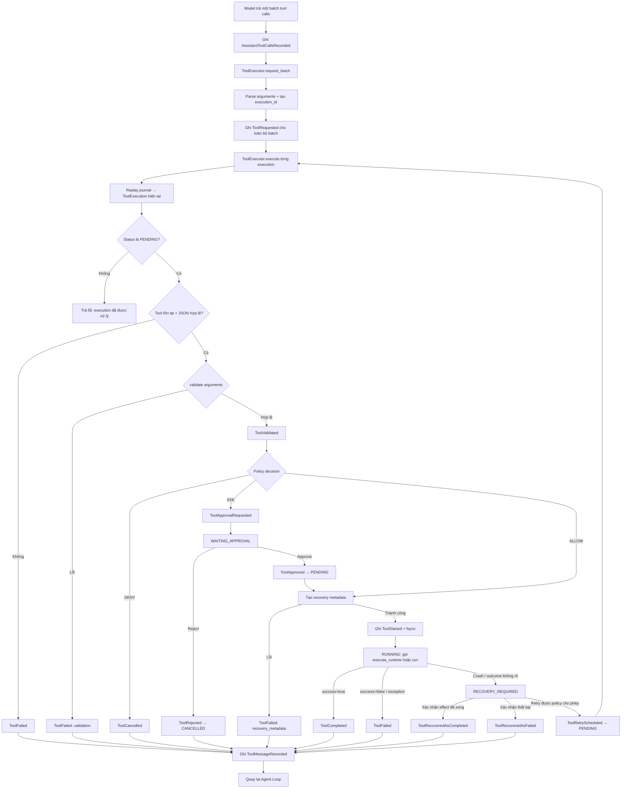
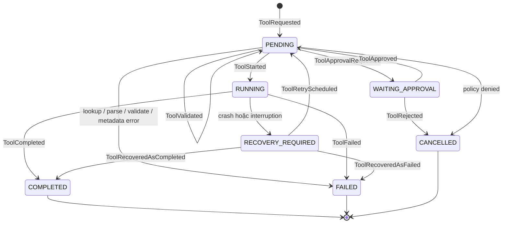
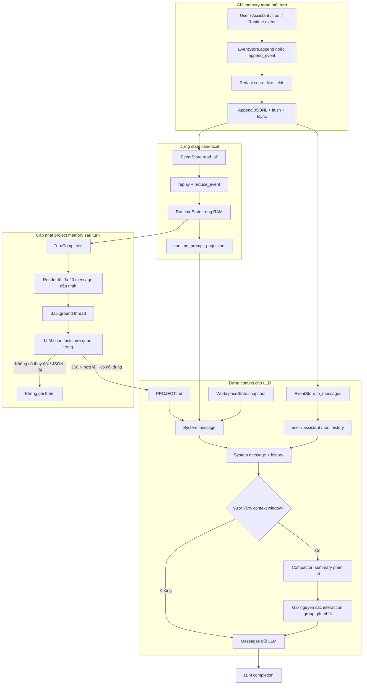
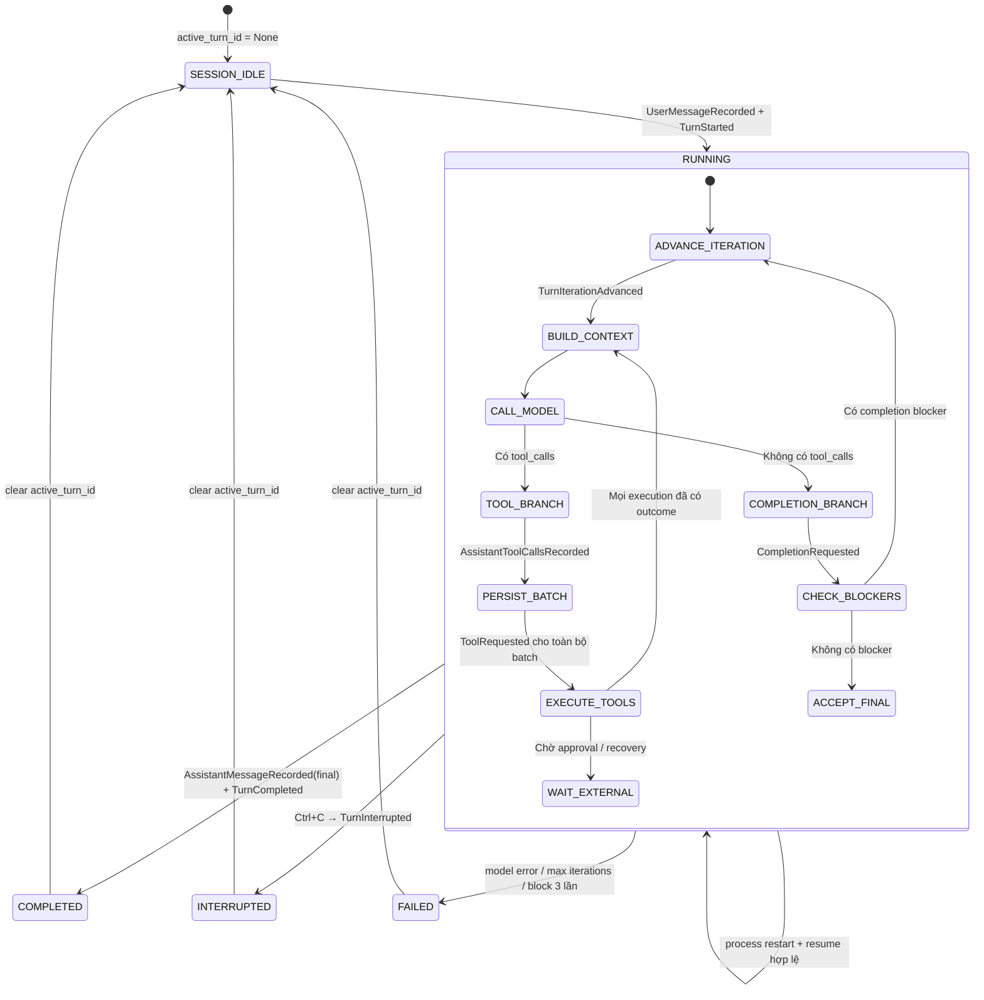
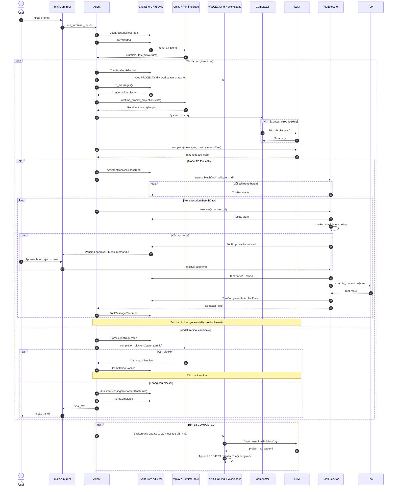
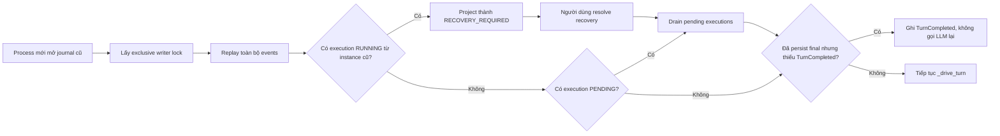

# Lifecycle và luồng dữ liệu của Coding Agent

> Tài liệu này mô tả **implementation hiện tại**, tập trung vào bốn góc nhìn:
> lifecycle của Tool Executor, Agent Memory, state machine của Agent Loop và luồng
> end-to-end tổng hợp.

## Bản đồ thành phần

| Thành phần | Trách nhiệm chính |
|---|---|
| [`src/main.py`](../src/main.py) | CLI, mở/resume session, xử lý approval và recovery |
| [`src/agent/loop.py`](../src/agent/loop.py) | Điều phối turn, gọi LLM, chạy tool và chốt kết quả |
| [`src/runtime/executor.py`](../src/runtime/executor.py) | Lifecycle bền vững của từng tool execution |
| [`src/runtime/reducer.py`](../src/runtime/reducer.py) | Replay event thành `RuntimeState` và kiểm tra transition |
| [`src/runtime/models.py`](../src/runtime/models.py) | Enum và data model cho turn, plan, tool execution |
| [`src/memory/event_store.py`](../src/memory/event_store.py) | Append-only JSONL journal và message projection |
| [`src/memory/manager.py`](../src/memory/manager.py) | Project memory bền vững trong `PROJECT.md` |
| [`src/context/compactor.py`](../src/context/compactor.py) | Rút gọn context cũ khi gần giới hạn token |
| [`src/agent/state.py`](../src/agent/state.py) | Snapshot trực tiếp của workspace và Git |

---

## 1. Lifecycle của Tool Executor

Một model tool call được tách thành hai ID:

- `tool_call_id`: ID từ provider/model, dùng trong protocol message;
- `execution_id`: ID do runtime tạo, dùng cho approval, retry và recovery.

`request_batch()` ghi toàn bộ `ToolRequested` của batch trước khi chạy tool đầu tiên.
Mỗi lần `execute()` đều replay journal để lấy trạng thái canonical mới nhất.

### State machine của một tool execution

Các trạng thái terminal là `COMPLETED`, `FAILED`, `CANCELLED`.
`RECOVERY_REQUIRED` chưa terminal vì cần người dùng xác nhận outcome hoặc retry.

### Ranh giới an toàn quan trọng

1. `ToolStarted` được append, flush và `fsync` **trước side effect**.
2. Tool chỉ được chạy khi execution đang `PENDING`.
3. Arguments có key nhạy cảm bị ghi thành `[REDACTED]`; bản thật chỉ giữ tạm trong RAM.
4. Sau restart, tool đang `RUNNING` từ runtime instance cũ được project thành
   `RECOVERY_REQUIRED` thay vì tự động chạy lại.
5. Retry phụ thuộc `ReplayPolicy`: `REPLAY_SAFE`, `RECONCILABLE` hoặc `MANUAL`.

---

## 2. Luồng Agent Memory

Agent có nhiều lớp “memory”, mỗi lớp có vai trò khác nhau:

| Lớp | Nguồn | Tuổi thọ | Mục đích |
|---|---|---|---|
| Session journal | `memory/chats/<session>.jsonl` | Xuyên restart | Nguồn sự thật cho message và runtime lifecycle |
| Runtime projection | `replay(events)` | Trong RAM, dựng lại được | Trạng thái turn, plan và tool execution hiện tại |
| Provider context | System prompt + message history | Một lần gọi model | Ngữ cảnh trực tiếp gửi cho LLM |
| Compacted context | Summary + nhóm message gần nhất | Một lần gọi model | Giảm token mà không làm vỡ tool-call/result group |
| Project memory | `src/memory/private/PROJECT.md` | Xuyên session | Facts, kiến trúc, quyết định và vấn đề lâu dài |
| Workspace snapshot | Filesystem + Git | Đọc mới khi build context | `cwd`, branch và file đang thay đổi |

### Nguyên tắc dữ liệu

- **Journal là source of truth**; `RuntimeState` chỉ là projection dựng lại được.
- `PROJECT.md` hỗ trợ reasoning nhưng không được dùng để quyết định transition.
- `WorkspaceState` phản ánh môi trường thật tại thời điểm đọc, không phải lifecycle state.
- Runtime event không được gửi thẳng cho model như chat message; model chỉ nhận một
  projection ngắn của runtime state trong system prompt.
- Compaction chỉ biến đổi context gửi model, không sửa hoặc xóa journal gốc.
- Assistant tool call và các tool result tương ứng được compact như một nhóm nguyên tử.

---

## 3. State machine của Agent Loop

Trong implementation hiện tại, `IDLE` không tồn tại dưới dạng một `TurnState`.
Session rảnh được biểu diễn bằng `RuntimeState.active_turn_id is None`; `TurnStarted`
tạo trực tiếp một turn ở trạng thái `RUNNING`.

### Completion blockers

Trước khi chấp nhận final text, `completion_blockers()` kiểm tra:

1. plan bắt buộc nhưng chưa được tạo;
2. required plan step chưa `COMPLETED` hoặc `SKIPPED`;
3. tool của turn còn `WAITING_APPROVAL`, `RUNNING` hoặc `RECOVERY_REQUIRED`.

Nếu bị block, agent ghi `CompletionBlocked` và chạy iteration tiếp theo. Ba lần block
liên tiếp dẫn đến `TurnFailed(category="repeated_incomplete_plan")`.

### Terminal paths

| Kết quả | Event | Điều kiện chính |
|---|---|---|
| Thành công | `TurnCompleted` | Candidate không còn completion blocker |
| Gián đoạn | `TurnInterrupted` | Người dùng ngắt model/tool flow |
| Thất bại | `TurnFailed` | Model exception, hết iteration hoặc block lặp lại |
| Tạm dừng | Không terminal | Đang chờ approval hoặc recovery |

---

## 4. Luồng tổng hợp end-to-end

Sơ đồ sau kết nối CLI, Agent Loop, Memory, LLM và Tool Executor trong một turn.

### Resume sau restart

---

## 5. Tóm tắt các invariant

1. Mỗi session chỉ có một writer và tối đa một active turn.
2. Event journal là append-only, có `seq` tăng dần và được `fsync`.
3. Mọi lifecycle transition đều xuất phát từ event và được reducer kiểm tra.
4. Tool side effect chỉ bắt đầu sau khi `ToolStarted` đã được persist.
5. Tool terminal không được transition thêm hoặc chạy lần hai.
6. Outcome không rõ sau restart phải qua recovery, không tự động đoán.
7. Final answer chỉ được persist khi không còn completion blocker.
8. Compaction và `PROJECT.md` không thay thế runtime state canonical.
