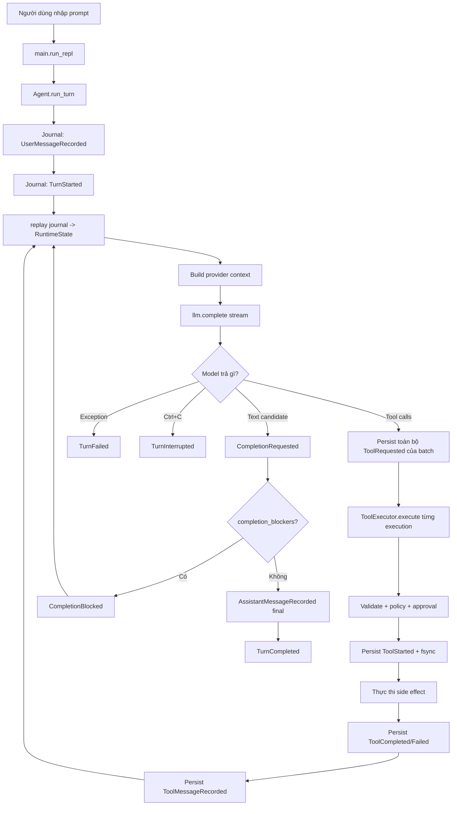
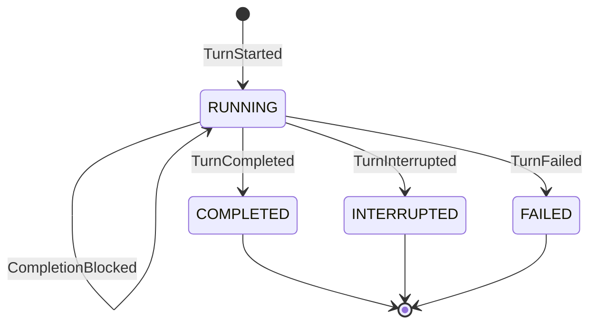
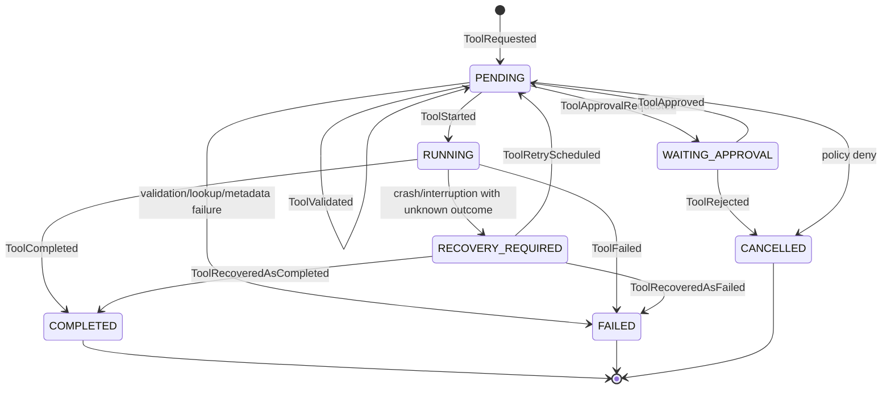
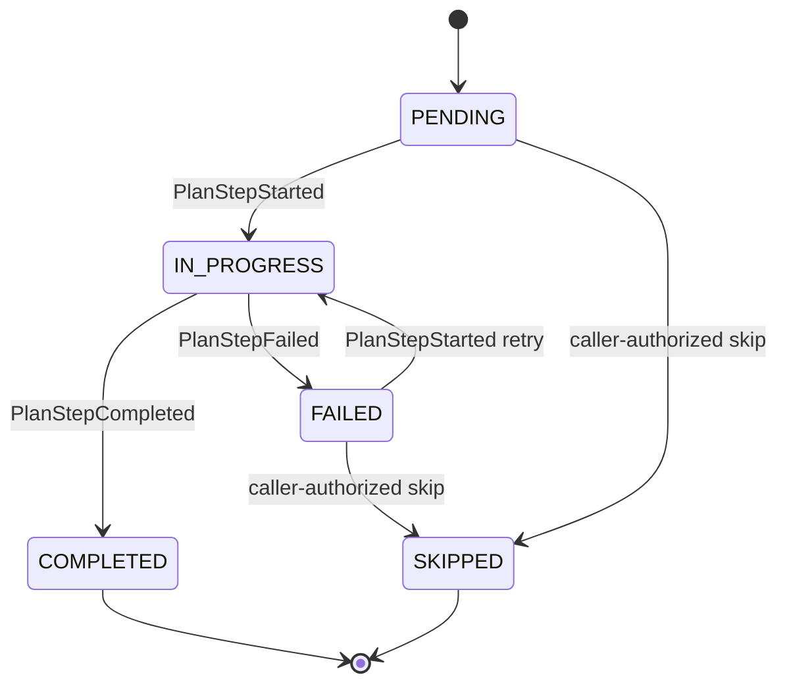
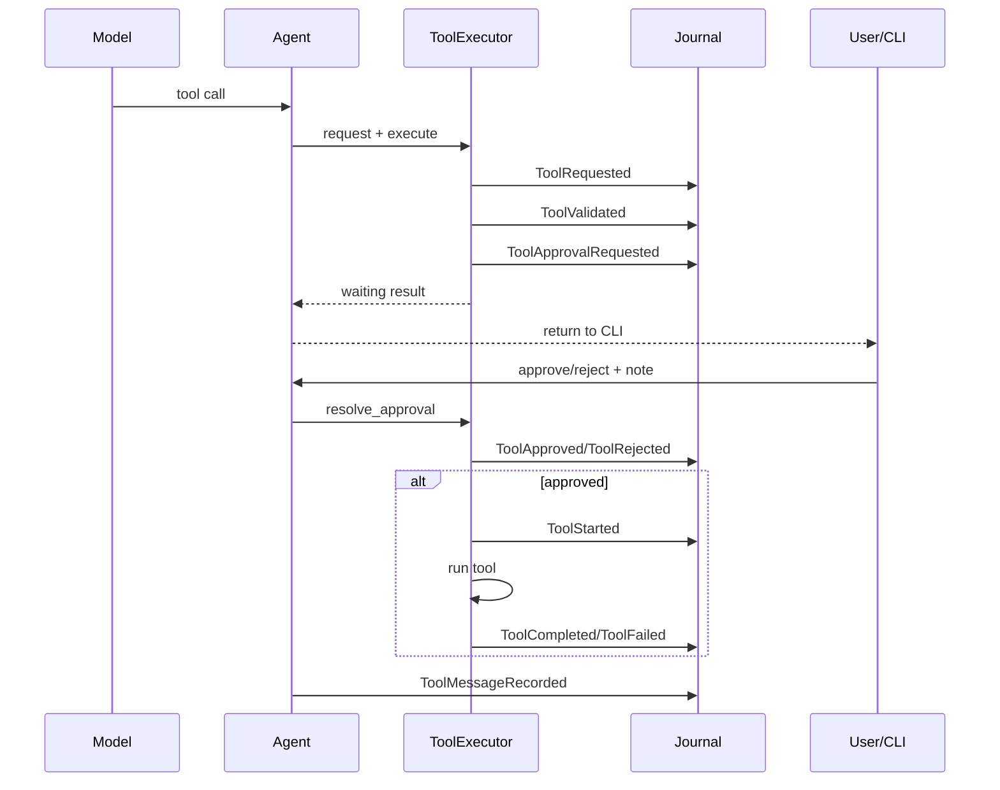

# Hướng dẫn toàn bộ luồng Runtime State Management

> Tài liệu này giải thích **code hiện tại trên `main`**, không chỉ mô tả ý tưởng thiết kế.
> Mục tiêu là giúp người đã hiểu agent loop cũ có thể lần theo code mới từ lúc
> người dùng nhập prompt đến lúc turn hoàn thành, bị chặn, thất bại hoặc được
> khôi phục sau crash.

---

## 1. Tóm tắt trong một phút

Code cũ chủ yếu vận hành như sau:

```text
user input
  -> gọi model
  -> nếu model gọi tool thì chạy tool
  -> đưa kết quả tool lại cho model
  -> nếu model trả text thì kết thúc
```

Code mới **giữ nguyên model-driven loop đó**, nhưng bọc bên ngoài bằng một runtime
harness có journal và state machine:

```text
user input
  -> ghi sự kiện bền vững xuống JSONL
  -> dựng RuntimeState từ toàn bộ journal
  -> gọi model với projection của state
  -> kiểm tra tool call / plan transition
  -> ghi ToolStarted xuống disk TRƯỚC side effect
  -> chạy tool
  -> ghi terminal outcome
  -> kiểm tra completion blockers
  -> chỉ chấp nhận final answer khi runtime cho phép
```

Ý quan trọng nhất:

> **Journal là sự thật gốc. `RuntimeState` chỉ là ảnh dựng lại từ journal.**

Không còn coi object Python đang nằm trong RAM là nguồn sự thật duy nhất. Nếu
process chết, process mới đọc lại journal và reconstruct state.

---

## 2. Bản đồ các file

| File | Trách nhiệm |
|---|---|
| [`src/main.py`](../src/main.py) | CLI, chọn session, nhập prompt, approval/recovery UI, đóng agent |
| [`src/agent/loop.py`](../src/agent/loop.py) | Điều phối turn, model loop, tool batch, plan action, completion |
| [`src/runtime/models.py`](../src/runtime/models.py) | Enum và dataclass của turn, plan, tool execution |
| [`src/runtime/reducer.py`](../src/runtime/reducer.py) | Replay event thành `RuntimeState`, validate historical transition |
| [`src/runtime/executor.py`](../src/runtime/executor.py) | Lifecycle của một tool execution và recovery |
| [`src/runtime/machine.py`](../src/runtime/machine.py) | Primitive FSM tổng quát, hiện dùng làm contract/test độc lập |
| [`src/memory/event_store.py`](../src/memory/event_store.py) | Append-only JSONL journal, lock, fsync, redaction, projection |
| [`src/context/compactor.py`](../src/context/compactor.py) | Compact message history nhưng không làm vỡ tool-call group |
| [`src/tools/base.py`](../src/tools/base.py) | Contract chung của tool và `ToolResult` |
| [`src/tools/registry.py`](../src/tools/registry.py) | Registry của `read`, `write`, `edit`, `bash` |
| [`src/tools/plan.py`](../src/tools/plan.py) | Schema tool nội bộ `update_plan` |
| [`src/tools/filesystem.py`](../src/tools/filesystem.py) | Read/write/edit và metadata hash cho recovery |
| [`src/tools/terminal.py`](../src/tools/terminal.py) | Bash tool, recovery policy là manual |
| [`src/agent/state.py`](../src/agent/state.py) | Chỉ còn workspace snapshot; không giữ lifecycle truth |

### Điểm khác lớn so với code cũ

Trước đây `agent/state.py` chứa những object state được mutate trực tiếp. Bây giờ:

- workspace state vẫn được đọc trực tiếp từ filesystem/Git;
- lifecycle state nằm trong `runtime/models.py`;
- lifecycle state được dựng bởi `replay()` trong `runtime/reducer.py`;
- mọi thay đổi lifecycle phải bắt đầu bằng một event trong journal.

---

# PHẦN I — LUỒNG TỔNG QUÁT

## 3. Sơ đồ tổng thể



Có ba lớp dữ liệu khác nhau cần phân biệt:

1. **Journal events**: lịch sử canonical, append-only trên disk.
2. **RuntimeState**: object Python dựng lại từ journal.
3. **Provider messages**: projection gửi cho model, chỉ chứa system/user/assistant/tool.

Không được coi ba lớp này là một.

---

## 4. Các ID quan trọng

Một session có nhiều loại ID:

| ID | Ý nghĩa |
|---|---|
| `session_id` | ID của file chat/journal |
| `runtime_instance_id` | ID process/instance đang mở journal |
| `turn_id` | ID của một lượt xử lý yêu cầu người dùng |
| `plan_id` | ID của plan đang active |
| `step_id` | ID ổn định của một plan step, ví dụ `step_1` |
| `tool_call_id` | ID do provider/model tạo cho tool call |
| `execution_id` | ID runtime tự tạo cho một lần thực thi tool |
| `event_id` | UUID riêng của từng event |
| `seq` | Số thứ tự tăng dần trong session journal |

### Vì sao `tool_call_id` và `execution_id` khác nhau?

`tool_call_id` thuộc protocol với model. `execution_id` thuộc runtime lifecycle.
Runtime cần ID riêng để:

- theo dõi attempt/retry;
- approval đúng lần thực thi;
- recovery sau crash;
- liên kết evidence của plan;
- không phụ thuộc format ID của provider.

---

# PHẦN II — TỪ LÚC NGƯỜI DÙNG NHẬP PROMPT

## 5. Khởi động CLI

Entry point là `main()` trong [`src/main.py`](../src/main.py).

### Chat mới

```bash
PYTHONPATH=src .venv/bin/python -m main
```

`select_chat_path()` gọi `create_chat_path()` và tạo đường dẫn dạng:

```text
memory/chats/<session-uuid>.jsonl
```

### Resume chat

```bash
PYTHONPATH=src .venv/bin/python -m main resume --last
```

hoặc:

```bash
PYTHONPATH=src .venv/bin/python -m main resume <session-id-prefix>
```

`resolve_chat()` tìm journal cũ. `Agent` mới sẽ mở journal đó và replay state.

### Lock session

Khi `EventStore(writer=True)` mở file, nó lấy non-blocking exclusive lock bằng
`fcntl.flock`.

Nếu một process khác đang giữ cùng session:

```text
JournalLockedError: Session journal is already open
```

Điều này đảm bảo một session chỉ có một writer.

### Khởi tạo `Agent`

`Agent.__init__()` tạo:

```text
EventStore
MemoryManager
Compactor
WorkspaceState
RuntimeState = replay(all events)
UpdatePlanTool
ToolExecutor
```

Dòng quan trọng về kiến trúc là:

```python
self.runtime_state = replay(self.event_store.read_all(), ...)
```

Nghĩa là state ban đầu không được đoán từ message gần nhất. Nó được reconstruct từ
toàn bộ event hợp lệ.

---

## 6. Xử lý pending action trước khi nhận prompt mới

Ngay sau khi tạo `Agent`, `run_repl()` gọi:

```python
handle_pending_runtime_actions(agent)
```

Runtime có thể đang chờ:

- `approval`: tool đang ở `WAITING_APPROVAL`;
- `recovery`: tool đang ở `RECOVERY_REQUIRED`.

CLI bắt người dùng giải quyết các action đó trước khi tiếp tục.

Sau đó REPL mới đọc:

```python
user_text = input("agent> ").strip()
```

Nếu có active turn cũ, CLI không cho tạo turn mới. Người dùng phải nhập `resume`.

---

## 7. Khi người dùng nhập prompt mới

Ví dụ:

```text
agent> đọc pyproject.toml rồi cho mình biết Python version
```

CLI gọi:

```python
agent.run_turn(user_text, image_paths)
```

`run_turn()` thực hiện theo thứ tự sau.

### Bước 1 — Không cho mở hai active turn

```python
if self.runtime_state.active_turn_id is not None:
    raise RuntimeError(...)
```

Một session V1 chỉ có tối đa một active turn.

### Bước 2 — Runtime tạo `turn_id`

```python
turn_id = str(uuid4())
```

ID do harness tạo, không do model tạo.

### Bước 3 — Ghi user message

`EventStore.append("user", ...)` không còn ghi record chat tự do. Nó chuyển thành
một typed message event:

```text
UserMessageRecorded
```

Event này có thể được `to_messages()` project trở lại thành:

```json
{
  "role": "user",
  "content": "đọc pyproject.toml rồi cho mình biết Python version"
}
```

### Bước 4 — Ghi `TurnStarted`

Payload chính:

```json
{
  "goal": "đọc pyproject.toml rồi cho mình biết Python version",
  "plan_mode": "optional",
  "resumes_turn_id": null
}
```

`_event()` luôn làm hai việc:

```text
append_event(...)
refresh = replay(all events)
```

Sau event này:

```text
RuntimeState.active_turn_id = turn_id
TurnState.status = RUNNING
TurnState.iteration = 0
```

### Bước 5 — Vào `_drive_turn()`

Đây là model-driven loop thực sự.

```python
for _ in range(max_iterations):
```

Mỗi vòng lặp bắt đầu bằng `TurnIterationAdvanced`.

Nếu `max_iterations=20`, iteration hợp lệ sẽ tăng tuần tự:

```text
0 -> 1 -> 2 -> ... -> 20
```

Reducer reject số iteration nhảy cóc hoặc lặp lại.

---

## 8. Build context gửi model

Trước mỗi lần gọi model, `_build_context()` tạo messages.

### 8.1 System message

System message chứa ba phần:

```text
PROJECT.md facts
Runtime state projection
Workspace state
```

#### PROJECT.md

Đây là project memory. Nó hỗ trợ model nhớ facts, nhưng **không quyết định state
transition**.

#### Runtime state projection

`runtime_prompt_projection()` render state canonical hiện tại, ví dụ:

```text
Turn <id>: running
Goal: sửa parser
Iteration: 2
Blocker unfinished_required_steps: Required plan steps are unfinished. step_2
```

Đây là cách model biết plan/blocker hiện tại mà không cần tự nhớ từ history.

#### Workspace state

`WorkspaceState` đọc:

- current working directory;
- Git branch;
- modified files.

Đây là live environment projection, không phải lifecycle state.

### 8.2 Provider message history

`EventStore.to_messages()` chỉ lấy bốn loại message event:

- `UserMessageRecorded`;
- `AssistantToolCallsRecorded`;
- `ToolMessageRecorded`;
- `AssistantMessageRecorded`.

Các runtime event như `TurnStarted`, `ToolStarted`, `PlanCreated` **không gửi trực
tiếp thành conversation message**.

### 8.3 Context compaction

Nếu token vượt 70% context window, `Compactor` tóm tắt phần cũ.

Nhưng nó nhóm nguyên tử:

```text
AssistantToolCallsRecorded
  + tất cả ToolMessageRecorded tương ứng
```

Do đó không có trường hợp model nhận một tool result mà thiếu assistant tool call
đã sinh ra result đó.

System runtime projection luôn được dựng lại từ `RuntimeState`, không lấy từ summary.

---

## 9. Gọi model và gom stream

Agent gọi:

```python
llm.complete(
    messages=context,
    tools=registry.get_schemas() + [update_plan_schema],
    stream=True,
)
```

Model thấy năm tool:

```text
read
write
edit
bash
update_plan
```

`_consume_stream()` gom hai loại delta:

1. text content;
2. fragmented tool calls.

Tool call có thể bị provider chia thành nhiều chunk. `StreamedToolCall` nối dần:

```text
function.name += chunk.name
function.arguments += chunk.arguments
```

Cuối stream, agent nhận:

```python
response_text, tool_calls
```

Sau đó chia thành hai nhánh chính:

```text
tool_calls không rỗng -> tool branch
không có tool call     -> completion branch
```

---

# PHẦN III — TURN STATE MACHINE

## 10. Turn states

Enum nằm trong `runtime/models.py`:

```text
IDLE
RUNNING
COMPLETED
INTERRUPTED
FAILED
```

Trong implementation hiện tại, không có `TurnState` object ở `IDLE`. Khi không có
active turn, trạng thái session được biểu diễn bằng:

```python
RuntimeState.active_turn_id is None
```

`TurnStarted` tạo object trực tiếp ở `RUNNING`.

## 11. Turn transition diagram



Terminal states:

```text
COMPLETED
INTERRUPTED
FAILED
```

Reducer không cho terminal turn nhận thêm transition.

## 12. Các turn event

| Event | Khi nào phát sinh | Tác động lên projection |
|---|---|---|
| `TurnStarted` | Nhận prompt mới | Tạo turn `RUNNING`, set active turn |
| `TurnIterationAdvanced` | Trước mỗi model call | Tăng iteration tuần tự |
| `CompletionRequested` | Model trả candidate text | Audit candidate, chưa terminal |
| `CompletionBlocked` | Candidate vi phạm blocker | Tăng consecutive block count |
| `TurnCompleted` | Candidate được chấp nhận | Set `COMPLETED`, final text, clear active turn |
| `TurnInterrupted` | Ctrl+C / interruption sạch | Set `INTERRUPTED`, clear active turn |
| `TurnFailed` | Model/infrastructure lỗi hoặc limit | Set `FAILED`, lưu structured error |

## 13. Direct-answer flow

Nếu model trả text và không gọi tool:

```text
UserMessageRecorded
TurnStarted
TurnIterationAdvanced
CompletionRequested
AssistantMessageRecorded(final=true)
TurnCompleted
```

Lưu ý thứ tự cuối:

1. runtime audit candidate bằng `CompletionRequested`;
2. kiểm tra blockers;
3. persist accepted assistant final;
4. persist `TurnCompleted`.

Nếu process chết sau bước 3 nhưng trước bước 4, resume thấy persisted final và ghi
`TurnCompleted` **mà không gọi model lần nữa**.

## 14. Completion guard

`completion_blockers(state, turn_id)` kiểm tra theo thứ tự ổn định:

1. `PlanMode.REQUIRED` nhưng chưa có plan;
2. required plan steps chưa resolved;
3. tool execution đang `WAITING_APPROVAL`, `RUNNING` hoặc `RECOVERY_REQUIRED`.

Nếu có blocker:

```text
CompletionRequested
CompletionBlocked
```

Candidate không được ghi thành assistant final.

Nếu plan enforcement đang active, `_consume_stream(..., emit_text=False)` buffer text,
nên candidate bị block cũng không bị in như câu trả lời cuối.

### Ba lần block liên tiếp

Mỗi `CompletionBlocked` tăng `completion_block_count`.

Nếu model ba lần liên tiếp muốn kết thúc khi required work chưa xong:

```text
TurnFailed(category="repeated_incomplete_plan")
```

Accepted progress như plan/tool terminal event reset block count về 0.

## 15. Max iteration

Nếu vòng lặp dùng hết `max_iterations`:

```text
TurnFailed(category="max_iterations")
```

Turn không bị bỏ lại ở trạng thái mơ hồ.

## 16. Model exception

Nếu `llm.complete()` hoặc consume stream ném `Exception`:

```text
TurnFailed(
  category="model",
  message=<error>,
  exception_type=<class>
)
```

Sau khi persist failure, exception được re-raise để CLI báo cho người dùng.

## 17. KeyboardInterrupt

Nếu người dùng Ctrl+C trong model stream:

```text
TurnInterrupted(reason="user")
```

Partial text không được persist thành final assistant response.

`INTERRUPTED` là terminal. Nếu muốn tiếp tục về mặt API, tạo turn mới có
`resumes_turn_id` trỏ về turn cũ. CLI hiện tại chưa có command riêng để truyền
`resumes_turn_id`; CLI `resume` chủ yếu tiếp tục một turn còn `RUNNING` sau crash.

---

# PHẦN IV — TOOL CALL LIFECYCLE

## 18. Tool call branch tổng quát

Giả sử model gọi:

```json
{
  "id": "call_abc",
  "function": {
    "name": "read",
    "arguments": "{\"path\":\"pyproject.toml\"}"
  }
}
```

Agent làm theo thứ tự:

```text
1. AssistantToolCallsRecorded
2. ToolRequested
3. ToolValidated
4. policy decision
5. ToolStarted (flush + fsync)
6. tool.run() — side effect bắt đầu ở đây
7. ToolCompleted hoặc ToolFailed
8. ToolMessageRecorded
9. quay lại model loop
```

## 19. Vì sao persist cả batch trước khi chạy call đầu tiên?

Một model response có thể chứa nhiều tool calls.

`request_batch()` duyệt toàn bộ calls và ghi tất cả `ToolRequested` trước khi
`execute()` call đầu.

Ví dụ hai calls:

```text
ToolRequested(call A)
ToolRequested(call B)
ToolValidated(call A)
ToolStarted(call A)
... effect A ...
```

Nếu crash khi A đang chạy, runtime vẫn biết B đã được request nhưng chưa start.
Resume sẽ xử lý pending batch trước khi gọi model tiếp.

Điều này tránh gửi model một batch chưa có outcome đầy đủ.

---

## 20. Tool execution state machine



Terminal tool states:

```text
COMPLETED
FAILED
CANCELLED
```

`RECOVERY_REQUIRED` không terminal vì còn cần quyết định.

## 21. Tool execution fields

`ToolExecution` giữ:

| Field | Ý nghĩa |
|---|---|
| `execution_id` | Runtime ID của lần thực thi |
| `tool_call_id` | Provider/model call ID |
| `session_id` | Session sở hữu execution |
| `turn_id` | Turn sở hữu execution |
| `tool_name` | `read`, `write`, `edit`, `bash`, `update_plan` |
| `arguments` | Arguments đã persist; secret-like fields bị redact |
| `status` | Lifecycle status |
| `requested_at` | Thời điểm request |
| `started_at` | Thời điểm effect được phép bắt đầu |
| `finished_at` | Thời điểm terminal |
| `attempt` | Số retry đã schedule |
| `replay_policy` | Cách recovery cho tool |
| `approval` | Approval metadata nếu có |
| `result` | Raw + compact + success + exit code |
| `error` | Structured error nếu failed |
| `recovery_metadata` | Hash/path/instance phục vụ reconcile |

---

## 22. `ToolExecutor.request_batch()` chi tiết

Với mỗi model tool call:

1. tạo `execution_id`;
2. lookup tool để biết `replay_policy`;
3. parse JSON arguments;
4. giữ original parsed arguments trong `_transient_arguments`;
5. ghi `ToolRequested`.

### Tại sao có `_transient_arguments`?

Secret-like fields bị redact trước khi ghi journal:

```json
{"token":"[REDACTED]"}
```

Tool trong process hiện tại vẫn cần giá trị thật để chạy. Vì vậy giá trị thật chỉ
nằm trong RAM tại `_transient_arguments`.

Sau restart, nếu execution chưa chạy mà arguments cần secret đã bị redact, runtime
**fail closed** thay vì chạy với chuỗi `[REDACTED]` hoặc cố đoán secret.

---

## 23. `ToolExecutor.execute()` chi tiết

### 23.1 Replay trước khi quyết định

Mỗi lần execute bắt đầu bằng:

```python
state = replay(store.read_all(), current_runtime_instance_id=...)
```

Executor không tin object cũ đang giữ trong RAM.

### 23.2 Chỉ `PENDING` mới được execute

Nếu status là terminal, waiting approval hoặc running:

```text
Error: execution <id> is already <status>
```

Tool không chạy lần hai.

### 23.3 Lookup và parse validation

Các failure trước side effect:

- unknown tool;
- malformed argument JSON;
- missing required fields;
- redacted arguments không thể replay;
- không tạo được recovery metadata.

Các trường hợp này ghi `ToolFailed` nhưng không có `ToolStarted`.

### 23.4 Policy

Policy trả một trong ba giá trị:

```text
ALLOW
ASK
DENY
```

Default hiện tại là `ALLOW`.

#### DENY

```text
ToolValidated
ToolCancelled(reason="policy denied")
ToolMessageRecorded(error result)
```

Tool không chạy.

#### ASK

```text
ToolValidated
ToolApprovalRequested
```

Nếu không có synchronous `approval_handler`, agent dừng model progress và trả về
CLI. CLI sẽ hỏi user.

#### ALLOW

Đi thẳng tới recovery metadata và `ToolStarted`.

### 23.5 Durable start boundary

Trước khi gọi `tool.run()`:

```python
store.append_event("ToolStarted", ...)
```

`append_event()` thực hiện:

```text
write JSON line
flush
fsync
```

Chỉ sau khi cả ba thành công mới chạy side effect.

Nếu disk write/fsync lỗi, effect không được chạy. Đây là fail-closed boundary.

### 23.6 Chạy tool

Tool bình thường chạy qua:

```python
tool.run(**arguments)
```

`update_plan` là internal tool cần runtime context nên chạy qua:

```python
tool.execute_runtime(execution_id, turn_id, **arguments)
```

### 23.7 Kết quả

Nếu `ToolResult.success=True`:

```text
ToolCompleted
```

Nếu tool trả `success=False` hoặc ném `Exception`:

```text
ToolFailed
```

`ToolCompleted` lưu cả:

- `raw`: đầy đủ để audit;
- `compact`: rút gọn để gửi model;
- `success`;
- `exit_code` field trong persisted result model.

Provider message chỉ nhận `compact`.

### 23.8 Fatal interruption

Executor catch `Exception`, nhưng không catch `SystemExit` và các `BaseException`
fatal khác.

Nếu process chết sau `ToolStarted` mà chưa có terminal event, process sau sẽ đánh
dấu execution là `RECOVERY_REQUIRED`.

---

## 24. Các event sequence thường gặp

### Tool thành công

```text
AssistantToolCallsRecorded
ToolRequested
ToolValidated
ToolStarted
ToolCompleted
ToolMessageRecorded
```

### Tool validation lỗi

```text
AssistantToolCallsRecorded
ToolRequested
ToolFailed(category="validation")
ToolMessageRecorded
```

Không có `ToolStarted`, nên chắc chắn side effect chưa bắt đầu.

### Tool ném exception

```text
ToolRequested
ToolValidated
ToolStarted
ToolFailed(category="exception")
ToolMessageRecorded
```

### Policy deny

```text
ToolRequested
ToolValidated
ToolCancelled
ToolMessageRecorded
```

### Chờ approval

```text
ToolRequested
ToolValidated
ToolApprovalRequested
--- model progress dừng tại đây ---
```

Approve:

```text
ToolApproved
ToolValidated
ToolStarted
ToolCompleted hoặc ToolFailed
ToolMessageRecorded
```

Reject:

```text
ToolRejected
ToolMessageRecorded
```

---

# PHẦN V — PLAN LIFECYCLE

## 25. Plan không phải text checklist

Plan mới là structured runtime data:

```text
Plan
  plan_id
  mode
  active_revision
  revisions[]
    revision
    actor
    reason
    steps[]
      step_id
      task
      status
      required
      completion_policy
      note
      evidence_execution_ids
```

Model không được tự viết plan vào prompt rồi coi như hoàn thành. Nó phải gọi
`update_plan`.

## 26. Plan mode

```text
OPTIONAL
REQUIRED
```

### OPTIONAL

Không có plan vẫn có thể complete simple task.

Nhưng nếu model đã tạo plan, required steps của plan đó vẫn được enforce.

### REQUIRED

Không có plan thì final answer bị block.

> Lưu ý implementation hiện tại: CLI gọi `run_turn()` với default `OPTIONAL`.
> `REQUIRED` hiện được dùng qua Python API bằng
> `agent.run_turn(..., plan_mode=PlanMode.REQUIRED)`. CLI chưa có flag để chọn mode.

---

## 27. `update_plan` tool

Tool nội bộ hỗ trợ ba action:

```text
create
set_step_status
revise
```

Schema được đưa cho model cùng read/write/edit/bash.

### Create

Ví dụ arguments:

```json
{
  "action": "create",
  "reason": "Task có nhiều bước",
  "steps": [
    {
      "task": "Đọc code hiện tại",
      "required": true,
      "completion_policy": "self_attested"
    },
    {
      "task": "Sửa implementation",
      "required": true,
      "completion_policy": "evidence_required"
    }
  ]
}
```

Runtime tự gán:

```text
plan_id = UUID
step_1
step_2
```

Model không tự chọn trusted IDs.

### Set step status

```json
{
  "action": "set_step_status",
  "step_id": "step_1",
  "status": "in_progress"
}
```

Sau đó mới được complete:

```json
{
  "action": "set_step_status",
  "step_id": "step_1",
  "status": "completed",
  "note": "Đã đọc loop.py và executor.py"
}
```

### Revise

Revision phải có:

- non-empty reason;
- complete new step structure;
- `from_revision` và `to_revision` tăng tuần tự;
- actor audit metadata.

Runtime không cho model:

- xóa required work;
- đổi `required=true` thành false;
- âm thầm mutate completed/skipped step.

---

## 28. Plan step state machine



Không hợp lệ:

```text
PENDING -> COMPLETED
```

Runtime cũng chỉ cho tối đa một step `IN_PROGRESS` trong active revision.

## 29. Required work và skip

Required step chỉ resolved khi:

```text
COMPLETED
SKIPPED bởi caller/user có reason
```

Model không thể gọi `update_plan(status="skipped")`; runtime trả lỗi:

```text
model cannot skip a plan step
```

Caller có API:

```python
agent.skip_plan_step("step_2", "User hủy phần deployment")
```

Reason là bắt buộc.

## 30. Completion policy

### SELF_ATTESTED

Model có thể complete step nhưng phải đưa `note` không rỗng.

### EVIDENCE_REQUIRED

Model phải cung cấp `evidence_execution_ids`.

Mỗi evidence phải:

- tồn tại;
- cùng session;
- có status `COMPLETED`.

Ví dụ:

```json
{
  "action": "set_step_status",
  "step_id": "step_2",
  "status": "completed",
  "evidence_execution_ids": ["execution-uuid-của-test"]
}
```

## 31. Vì sao plan mutation cũng là tool execution?

`update_plan` đi qua chính `ToolExecutor`:

```text
ToolRequested(update_plan)
ToolValidated
ToolStarted
PlanCreated / PlanStepStarted / ...
ToolCompleted
ToolMessageRecorded
```

Plan event có:

```text
causation_id = execution_id của update_plan
```

Nhờ đó audit biết plan mutation nào do execution nào gây ra.

---

# PHẦN VI — JOURNAL VÀ REPLAY

## 32. Event envelope

Mỗi typed event có dạng:

```json
{
  "schema_version": 1,
  "event_id": "uuid",
  "seq": 42,
  "ts": "2026-09-06T13:00:00.123Z",
  "session_id": "session-id",
  "runtime_instance_id": "process-instance-id",
  "event_type": "ToolStarted",
  "aggregate_type": "tool_execution",
  "aggregate_id": "execution-id",
  "turn_id": "turn-id",
  "causation_id": "event/call gây ra event này",
  "correlation_id": "turn-id",
  "payload": {}
}
```

### Các field dùng để làm gì?

- `schema_version`: reject format tương lai chưa hỗ trợ;
- `event_id`: chống duplicate event;
- `seq`: xác định total order trong session;
- `ts`: audit timestamp UTC;
- `runtime_instance_id`: nhận biết started tool thuộc process cũ hay hiện tại;
- `aggregate_type/id`: event thuộc turn, plan, execution hay message;
- `causation_id`: cái gì gây ra event;
- `correlation_id`: gom event theo turn;
- `payload`: dữ liệu domain.

## 33. Append durability

`append_event()`:

```text
construct envelope
redact payload
seek end
write one JSON line
flush Python buffer
fsync OS file descriptor
update in-memory seq
```

In-memory `_seq` chỉ cập nhật sau `fsync` thành công.

## 34. Redaction

Các dictionary key sau bị redact đệ quy:

```text
password
secret
token
api_key
authorization
credential
```

Runtime cũng parse JSON string nằm ở key `arguments` để redact bên trong.

Ví dụ input:

```json
{"arguments":"{\"token\":\"abc\",\"path\":\"x\"}"}
```

Persisted:

```json
{"arguments":"{\"token\":\"[REDACTED]\",\"path\":\"x\"}"}
```

## 35. Journal validation

Khi mở journal, `EventStore` kiểm tra:

- `seq` phải là integer tăng nghiêm ngặt;
- typed event có đủ envelope fields;
- schema version phải hỗ trợ;
- event ID không trùng;
- một journal không trộn nhiều session ID;
- record legacy phải có `role`.

Malformed record giữa file làm load fail closed.

## 36. Torn final line repair

Nếu process chết giữa lúc ghi dòng cuối, dòng JSON cuối có thể bị cắt.

Runtime không tự âm thầm xóa. Nó báo `JournalCorruptionError(repairable=True)`.

Caller có thể gọi:

```python
EventStore.repair_trailing_partial(path)
```

Function:

1. xác nhận chỉ dòng cuối bị partial;
2. tạo file `.jsonl.bak`;
3. cắt bỏ đúng phần incomplete sau newline cuối.

Malformed line ở giữa file không được auto repair.

---

## 37. Reducer là gì?

Reducer là function:

```python
reduce_event(state, event) -> state
```

Nó không gọi:

- model;
- tool;
- network;
- filesystem side effect.

Nó chỉ validate event và update projection.

`replay(events)`:

```text
RuntimeState rỗng
  -> reduce event seq 1
  -> reduce event seq 2
  -> ...
  -> scan incomplete running executions
  -> RuntimeState cuối
```

Cùng event sequence phải tạo cùng state.

## 38. Reducer fail closed

Nếu journal chứa transition vô lý:

```text
TurnCompleted
TurnFailed trên cùng terminal turn
```

hoặc:

```text
PlanStepCompleted khi step còn PENDING
```

replay ném:

```text
JournalCorruptionError: invalid historical transition at seq N
```

Runtime không cố đoán state tiếp theo.

## 39. Message projection khác runtime projection

### `to_messages()`

Dùng cho model. Chỉ project chat protocol:

```text
user
assistant + tool_calls
provider tool result
assistant final
```

### `runtime_prompt_projection()`

Dùng để render lifecycle truth vào system message:

```text
active turn
iteration
goal
completion blockers
```

### `RuntimeState`

Dùng cho harness quyết định transition.

Model nhìn thấy projection, nhưng model không được quyền mutate `RuntimeState` trực
tiếp.

---

# PHẦN VII — STATE MACHINE ĐƯỢC IMPLEMENT Ở ĐÂU?

## 40. `runtime/machine.py`

File này định nghĩa primitive tổng quát:

```python
Transition(source, event_type, target, guard, action)
StateMachine.validate(...)
StateMachine.dispatch(...)
```

Nó thể hiện quy tắc:

1. tìm đúng `(source, event)`;
2. chạy guard trước mutation;
3. chỉ chạy action nếu guard pass;
4. trả target state.

### Quan trọng: production path hiện tại

Trong code hiện tại, `StateMachine` generic chủ yếu được kiểm chứng trong
`tests/test_machine.py`.

Production path không tạo các transition table rồi gọi `dispatch()`. Thay vào đó:

- reducer có transition table/guards cụ thể cho plan/tool/turn;
- executor enforce order trước side effect;
- agent loop emit event đúng lifecycle.

Vì vậy khi debug code đang chạy thật, hãy đọc theo thứ tự:

```text
Agent/ToolExecutor emit event
  -> EventStore persist
  -> reducer.reduce_event validate + project
```

Không nên bắt đầu từ `machine.py` rồi tìm caller production, vì hiện không có caller
production trực tiếp.

---

# PHẦN VIII — APPROVAL

## 41. Approval flow

Approval chỉ xuất hiện nếu injected policy trả `ASK`.

Default agent policy hiện là `ALLOW`, nên CLI bình thường không tự hỏi approval cho
mọi write/bash.

Luồng:



Approval note bắt buộc không rỗng.

Stale/wrong execution ID hoặc execution không ở `WAITING_APPROVAL` bị reject.

---

# PHẦN IX — CRASH VÀ RECOVERY

## 42. Khi nào outcome bị coi là unknown?

Case nguy hiểm:

```text
ToolStarted đã fsync
side effect có thể đã xảy ra
process chết
không có ToolCompleted/ToolFailed
```

Process mới có `runtime_instance_id` khác. Khi replay thấy execution vẫn `RUNNING`
và started instance là process cũ, nó project thành:

```text
RECOVERY_REQUIRED
```

Runtime không tự đoán effect đã chạy hay chưa.

## 43. Ba replay policy

```text
REPLAY_SAFE
RECONCILABLE
MANUAL
```

### REPLAY_SAFE

Dùng cho operation có thể chạy lại an toàn, hiện gồm:

- `read`;
- `update_plan` theo lifecycle/causation semantics.

Recovery có thể schedule retry sau persisted decision.

### RECONCILABLE

Dùng cho:

- `write`;
- `edit`.

Trước side effect, tool persist:

```text
path
before_hash
expected_after_hash
```

Sau crash:

- current hash = `expected_after_hash`: effect đã đạt kết quả mong muốn;
- current hash = `before_hash`: effect chưa làm thay đổi file, retry có thể xét;
- hash khác cả hai: state ngoài dự kiến, không blind retry.

### MANUAL

Dùng cho arbitrary `bash`.

Một command có thể:

- gửi request ra network;
- tạo process con;
- deploy;
- mutate DB;
- hoàn thành dù parent process chết.

Runtime không thể suy ra bằng file hash, nên không cho `RETRY` tự động.

---

## 44. Recovery decisions

Người dùng/caller chọn:

```text
COMPLETED
FAILED
RETRY
```

Mọi decision cần note không rỗng để audit.

### Mark completed

```text
ToolRecoveredAsCompleted
```

Với file tool, current hash phải bằng expected-after hash.

### Mark failed

```text
ToolRecoveredAsFailed
```

Dùng khi người kiểm tra xác nhận operation không đạt outcome.

### Retry

Điều kiện:

- policy không phải `MANUAL`;
- nếu `RECONCILABLE`, current hash phải bằng before hash.

Thứ tự:

```text
ToolRetryScheduled (persist + fsync)
status RECOVERY_REQUIRED -> PENDING
attempt += 1
execute lại
```

Decision luôn durable trước retry.

## 45. Giải thích đoạn `resolve_recovery()` đang mở

Đoạn code:

```python
if decision == RecoveryDecision.RETRY:
    if execution.replay_policy == ReplayPolicy.MANUAL:
        raise ValueError(...)
    if execution.replay_policy == ReplayPolicy.RECONCILABLE:
        current_hash = self._current_hash(...)
        if current_hash != before_hash:
            raise ValueError(...)
    append ToolRetryScheduled
    return execute(execution_id)
```

Ý nghĩa:

1. bash/manual không được retry vì outcome không thể suy ra;
2. file mutation chỉ retry khi file vẫn đúng trạng thái trước effect;
3. ghi quyết định retry trước;
4. reducer chuyển execution về `PENDING` và tăng attempt;
5. `execute()` mới được gọi lại.

Nhánh `COMPLETED` kiểm tra expected hash vì caller đang khẳng định effect đã hoàn
tất. Nếu file không có expected content, runtime không chấp nhận lời khẳng định đó.

---

# PHẦN X — RESUME ACTIVE TURN

## 46. Startup reconstruction

Process mới tạo `Agent`:

```text
open and lock journal
validate records
replay events
mark stale RUNNING tools as RECOVERY_REQUIRED
expose pending_runtime_actions
```

CLI giải quyết pending action trước REPL.

## 47. `resume_active_turn()`

Resume làm theo thứ tự:

1. phải có `active_turn_id`;
2. không được còn approval/recovery pending;
3. drain các tool executions ở `PENDING` trong batch cũ;
4. kiểm tra persisted final assistant message;
5. nếu có persisted final nhưng thiếu `TurnCompleted`, chỉ ghi terminal turn event;
6. nếu chưa có final, quay lại `_drive_turn()`.

### Không duplicate user message

Resume không gọi `run_turn()`, nên không append `UserMessageRecorded` lần nữa.

### Không duplicate model final

Nếu final message đã persisted trước crash, resume không gọi model để tạo lại text.

### Drain pending batch

Nếu model trước crash/request approval đã tạo batch A, B:

```text
ToolRequested A
ToolRequested B
A waiting approval
B pending
```

Sau khi giải quyết A, resume phải execute B và ghi tool result trước khi gọi model.

---

# PHẦN XI — VÍ DỤ END-TO-END

## 48. Ví dụ 1: hỏi trực tiếp, không tool

Prompt:

```text
agent> 2 + 2 bằng bao nhiêu?
```

Event timeline:

```text
1 UserMessageRecorded
2 TurnStarted
3 TurnIterationAdvanced(iteration=1)
4 CompletionRequested(candidate="4")
5 AssistantMessageRecorded(content="4", final=true)
6 TurnCompleted(final_text="4")
```

State cuối:

```text
turn.status = COMPLETED
active_turn_id = None
final_text = "4"
```

## 49. Ví dụ 2: đọc file

Prompt:

```text
agent> đọc pyproject.toml và cho biết Python version
```

Possible timeline:

```text
1  UserMessageRecorded
2  TurnStarted
3  TurnIterationAdvanced(1)
4  AssistantToolCallsRecorded(read)
5  ToolRequested(read)
6  ToolValidated(read)
7  ToolStarted(read)
8  ToolCompleted(read, raw + compact)
9  ToolMessageRecorded(compact result)
10 TurnIterationAdvanced(2)
11 CompletionRequested("Python >= 3.10")
12 AssistantMessageRecorded(final)
13 TurnCompleted
```

## 50. Ví dụ 3: required plan

Python API:

```python
agent.run_turn(
    "Refactor parser và chạy test",
    plan_mode=PlanMode.REQUIRED,
)
```

Model thử trả final ngay:

```text
CompletionRequested
CompletionBlocked(code="missing_required_plan")
```

Model tạo plan:

```text
AssistantToolCallsRecorded(update_plan create)
ToolRequested
ToolValidated
ToolStarted
PlanCreated
ToolCompleted
ToolMessageRecorded
```

Model chạy từng step:

```text
PlanStepStarted(step_1)
... read/edit tool executions ...
PlanStepCompleted(step_1, note/evidence)
PlanStepStarted(step_2)
... bash test execution ...
PlanStepCompleted(step_2, evidence_execution_ids=[...])
```

Lúc này candidate mới pass completion guard.

## 51. Ví dụ 4: crash khi write

Trước write:

```text
ToolRequested(write)
ToolValidated
ToolStarted(
  before_hash=AAA,
  expected_after_hash=BBB,
  path=x.py
)
```

Process chết trước terminal event.

### File hiện có hash BBB

Operation đã tạo expected content. Recovery có thể chọn `COMPLETED`:

```text
ToolRecoveredAsCompleted
```

Không write lại.

### File hiện có hash AAA

Operation chưa thay đổi file. Có thể chọn `RETRY`:

```text
ToolRetryScheduled
ToolValidated
ToolStarted
ToolCompleted
```

### File có hash CCC

Có mutation ngoài dự kiến. Runtime reject cả blind completion/retry theo hash guard;
người dùng phải kiểm tra và đưa state về tình trạng xác định.

## 52. Ví dụ 5: crash khi bash

```text
ToolStarted(bash: deploy.sh)
process chết
```

Process mới:

```text
RECOVERY_REQUIRED + replay_policy=MANUAL
```

CLI chỉ cho:

```text
completed
failed
```

Không offer retry. Người dùng phải kiểm tra deployment thật trước khi quyết định.

---

# PHẦN XII — RAW, COMPACT VÀ MEMORY

## 53. Raw vs compact

Tool trả:

```python
ToolResult(raw, compact, success)
```

### Raw

Dùng để audit trong terminal event. Có thể chứa full output.

### Compact

Dùng làm provider tool message, tránh nhét log quá dài vào model context.

Ví dụ bash giữ full stdout/stderr trong raw nhưng compact chỉ giữ tối đa 2000 ký tự
cuối, vì traceback/test summary thường nằm cuối.

## 54. PROJECT.md background update

Sau `TurnCompleted`, agent tạo daemon thread gọi `MemoryManager.update()`.

Điểm quan trọng:

- memory update xảy ra sau lifecycle completion;
- memory failure không làm đổi `TurnCompleted`;
- `PROJECT.md` không phải canonical lifecycle truth;
- xóa/change memory không thay đổi reconstructed turn/tool/plan state.

---

# PHẦN XIII — CÁCH DEBUG

## 55. Khi thấy state lạ, đọc theo thứ tự nào?

Không bắt đầu bằng object RAM. Làm theo thứ tự:

```text
1. Mở JSONL journal
2. Tìm turn_id / execution_id
3. Kiểm tra event seq và terminal event
4. Chạy replay hoặc inspect RuntimeState
5. Sau đó mới xem provider messages
```

## 56. In event timeline của session

Có thể dùng Python:

```bash
PYTHONPATH=src .venv/bin/python - <<'PY'
import json
from pathlib import Path

path = Path("memory/chats/SESSION_ID.jsonl")
for line in path.read_text(encoding="utf-8").splitlines():
    event = json.loads(line)
    print(
        event.get("seq"),
        event.get("event_type", event.get("role")),
        event.get("aggregate_id"),
        event.get("turn_id"),
    )
PY
```

## 57. Inspect reconstructed state

```bash
PYTHONPATH=src .venv/bin/python - <<'PY'
from pprint import pprint
from memory.event_store import EventStore
from runtime.reducer import replay

path = "memory/chats/SESSION_ID.jsonl"
with EventStore(path, writer=False) as store:
    pprint(replay(store.read_all()))
PY
```

## 58. Câu hỏi debug thường gặp

### “Tại sao model không chạy tiếp?”

Kiểm tra:

```python
agent.pending_runtime_actions()
```

Có thể đang chờ approval/recovery.

### “Tại sao final answer bị chặn?”

Kiểm tra:

```python
completion_blockers(agent.runtime_state, turn_id)
```

### “Tool có chạy thật chưa?”

- không có `ToolStarted`: effect chưa được phép bắt đầu;
- có `ToolStarted`, có terminal event: xem outcome;
- có `ToolStarted`, không terminal: unknown outcome/recovery required.

### “Tại sao không retry bash?”

Bash có `ReplayPolicy.MANUAL`; runtime không thể chứng minh command chưa tạo side effect.

### “Tại sao secret argument không resume được?”

Secret chỉ tồn tại transient trong RAM và bị redact trong journal. Sau restart runtime
không còn giá trị thật, nên fail closed.

---

# PHẦN XIV — GIỚI HẠN HIỆN TẠI

## 59. Những gì V1 chưa làm

1. **Không sandbox bash**: command đang chạy trực tiếp trên host.
2. **Default policy là ALLOW**: approval chỉ xuất hiện khi caller inject policy `ASK`.
3. **CLI chưa expose `PlanMode.REQUIRED`**: API có hỗ trợ nhưng CLI dùng default
   `OPTIONAL`.
4. **Generic `StateMachine` chưa được wire vào production reducer**: production
   enforce bằng reducer/executor guards.
5. **Secret không được lưu để replay**: an toàn hơn, nhưng pending secret tool call
   sau restart phải fail và được gọi lại với secret mới.
6. **Session V1 chỉ một active turn**.
7. **Journal dùng Linux `fcntl.flock`**.
8. **Không có distributed/multi-process event writer**.
9. **Memory update là background best-effort**, không thuộc correctness path.

Các giới hạn này là chủ ý V1, không nên “sửa nhanh” nếu chưa thay đổi design contract.

---

# PHẦN XV — THỨ TỰ ĐỌC CODE ĐỀ XUẤT

## 60. Đọc nhanh trong 30 phút

1. [`src/runtime/models.py`](../src/runtime/models.py): nhớ các enum/state fields.
2. [`src/agent/loop.py`](../src/agent/loop.py), đoạn `run_turn()` và `_drive_turn()`.
3. [`src/runtime/executor.py`](../src/runtime/executor.py), `request_batch()` và `execute()`.
4. [`src/runtime/reducer.py`](../src/runtime/reducer.py), `reduce_event()`.
5. [`src/memory/event_store.py`](../src/memory/event_store.py), `append_event()` và
   `to_messages()`.

## 61. Đọc sâu theo tình huống

### Muốn hiểu turn

```text
Agent.run_turn
Agent._drive_turn
reducer TurnStarted/TurnCompleted/TurnFailed branches
completion_blockers
```

### Muốn hiểu tool

```text
Agent tool_calls branch
ToolExecutor.request_batch
ToolExecutor.execute
reducer Tool* branches
BaseTool + concrete tool
```

### Muốn hiểu plan

```text
UpdatePlanTool schema
Agent._apply_plan_action
reducer Plan* branches
completion_blockers
```

### Muốn hiểu crash/recovery

```text
ToolStarted event
replay final stale-instance scan
pending_runtime_actions
ToolExecutor.resolve_recovery
Agent.resume_active_turn
CLI handle_pending_runtime_actions
```

---

# PHẦN XVI — MENTAL MODEL CUỐI CÙNG

## 62. Năm quy tắc để không bị “lú”

### Quy tắc 1

```text
Muốn biết chuyện gì đã xảy ra -> đọc journal.
```

### Quy tắc 2

```text
Muốn biết runtime hiện nghĩ gì -> replay journal thành RuntimeState.
```

### Quy tắc 3

```text
Muốn biết model thấy gì -> system projection + to_messages + compaction.
```

### Quy tắc 4

```text
Muốn biết tool có thể đã side-effect chưa -> tìm ToolStarted.
```

### Quy tắc 5

```text
Model đề xuất intent; runtime quyết định intent đó có được chuyển state/chạy effect không.
```

## 63. Công thức toàn bộ hệ thống

```text
COMMAND SIDE
Agent / ToolExecutor
    tạo event theo intent

WRITE SIDE
EventStore
    redact -> append -> flush -> fsync

READ SIDE
Reducer.replay
    validate -> reconstruct RuntimeState

MODEL VIEW
Runtime projection + provider message projection
    context có thể compact, correctness không phụ thuộc summary
```

Nếu chỉ nhớ một câu, hãy nhớ:

> **Không mutate lifecycle state rồi mới log. Hãy persist event trước, sau đó replay để
> có state mới; với side effect, `ToolStarted` phải durable trước khi tool chạy.**
