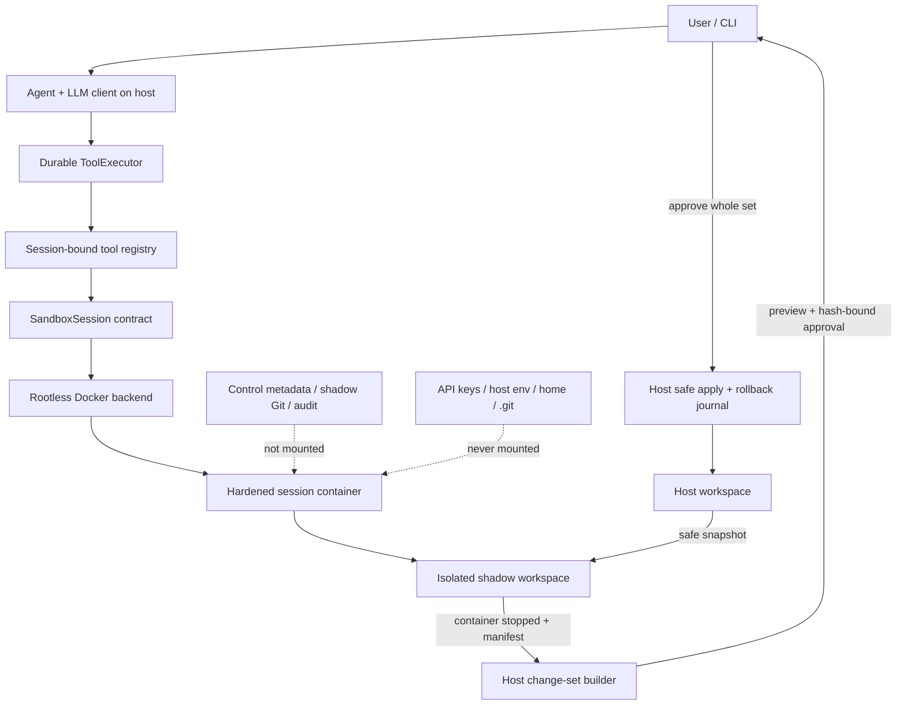

# Sandbox V1 Physical Enforcer — Implementation Plan

> **For agentic workers:** REQUIRED SUB-SKILL: use
> `superpowers:subagent-driven-development` (recommended) or
> `superpowers:executing-plans` to implement this plan task-by-task. Steps use
> checkbox syntax for tracking.

**Goal:** Mọi shell và filesystem side effect do main LLM yêu cầu đều chạy trong
một Docker rootless sandbox gắn với isolated shadow workspace; source thật chỉ
được thay đổi khi người dùng duyệt toàn bộ change set.

**Architecture:** Agent loop và LLM API tiếp tục chạy trên host như control
plane. Mỗi chat session sở hữu một shadow workspace và một hardened Docker
container sống suốt session; `bash`, `read`, `write`, `edit` chỉ thao tác qua
container. Host chịu trách nhiệm snapshot, lifecycle, audit, tạo change set và
apply sau approval.

**Tech stack:** Python 3.14, Python standard library, Docker Engine rootless,
Linux namespaces/cgroups v2, read-only OCI image, append-only JSONL journal,
host-side isolated shadow Git metadata.

**Spec:** Kiến trúc đích được mô tả trong
[coding_agent_safety_architecture.md](file:///home/sang/working/TLCN/repo/coding-agent/docs/coding_agent_safety_architecture.md).
Plan này chỉ triển khai **OS Sandbox / Physical Enforcer V1**; không triển khai
đầy đủ Action Normalizer, SLM reviewer, capability token, per-action checkpoint
hoặc injection screening.

---

## User Review Required

> [!IMPORTANT]
> **Cam kết bảo mật V1 là workspace-wide isolation.** Kernel/container chặn
> tool thoát khỏi isolated shadow workspace và chạm source/credential của host.
> V1 không cam kết kernel-enforced `fs_write` theo từng path bên trong workspace.
> Per-path scope chỉ là policy intent/audit metadata cho các phase sau.

> [!IMPORTANT]
> **Sandbox V1 tắt mạng hoàn toàn.** Container chạy với `--network=none`.
> `pip install`, `npm install`, `git fetch/pull/push` và mọi outbound request
> không được tự động mở mạng hoặc fallback sang host.

> [!WARNING]
> Docker rootless vẫn dùng chung kernel host. V1 giảm mạnh blast radius cho
> coding agent cá nhân nhưng không được quảng bá là boundary tương đương VM.
> gVisor là hardened profile tương lai; microVM dành cho hostile multi-tenant
> workloads.

> [!WARNING]
> Disk budget của bind-mounted shadow workspace là soft quota. Host watchdog có
> thể overshoot giữa hai lần đo. CPU, memory và PID limits phải được cgroup v2
> enforce; disk hard quota được để lại cho filesystem project quota/btrfs phase
> sau.

### Các quyết định đã chốt

- Threat model: coding agent cá nhân chạy local, repository có thể chứa mã độc
  hoặc prompt injection; hardened rootless container dùng chung kernel được
  chấp nhận cho V1.
- Một sandbox container sống suốt một chat session.
- Source đầu vào là snapshot của working tree hiện tại, gồm tracked changes và
  untracked files sau filtering.
- Không mount `.git` thật, home, `.env`, credential, Docker socket hoặc host
  caches vào container.
- Shadow Git metadata do host sở hữu và nằm ngoài writable mount.
- Snapshot dùng reflink/COW khi được xác minh an toàn; fallback copy thường;
  tuyệt đối không hardlink regular files.
- Filesystem enforcement vật lý ở mức toàn shadow workspace.
- Docker rootless là backend duy nhất; thiếu rootless/cgroups/hardening thì
  fail-closed.
- Image V1 là Python profile, immutable digest, dependencies được bake và pin;
  không cài package động.
- Change set approve/reject toàn bộ; một conflict hoặc policy violation chặn
  toàn bộ apply.
- Text, binary có giới hạn, delete và executable-bit hẹp được hỗ trợ; cấm
  symlink mới/đổi target và mọi special file.
- Mất heartbeat sẽ stop container; workspace được giữ 24 giờ để resume/review.
- `/changes`, `/apply`, `/discard` là control-plane commands chỉ người dùng gọi;
  `exit` stop container và giữ session 24 giờ.

## Open Questions

Không còn câu hỏi kiến trúc chặn triển khai. Các version/digest thực tế của base
image phải được resolve và ghi cố định khi thực thi Task 3; source được merge
chỉ khi không còn tag mutable như `latest` hoặc digest chưa xác định.

---

## Global Constraints

1. Không có code path fallback từ sandbox tool sang host execution.
2. Không gọi Docker qua `shell=True`; mọi host invocation dùng argv cố định.
3. Không truyền inherited host environment vào container. V1 dùng allowlist rỗng
   cho secrets và các biến runtime vô hại được khai báo tường minh.
4. API key/LLM client chỉ tồn tại trong host control plane.
5. Docker socket không bao giờ được mount vào sandbox.
6. Container bắt buộc có `--network=none`, `--read-only`, non-root user,
   `--cap-drop=ALL`, `no-new-privileges`, PID/memory/CPU limits và writable
   mounts chỉ gồm `/workspace` cùng bounded `/tmp` tmpfs.
7. Security failure phải fail loud/fail closed; không hạ cấp hardening ngầm.
8. Container, metadata và workspace đều gắn exact `session_id`; lookup không
   dùng fuzzy/prefix matching.
9. Host state nằm ngoài user workspace, permission directory `0700`, files
   `0600`, ưu tiên `${XDG_STATE_HOME:-~/.local/state}/sang-coding-agent`.
10. Không follow symlink khi snapshot, manifest, change calculation hoặc apply.
11. Apply approval bind với cryptographic hash của toàn change set. Nội dung đổi
    làm approval cũ hết hiệu lực.
12. Trước mọi apply, container phải stopped và host phải chạy three-way conflict
    check: baseline ↔ sandbox final ↔ workspace thật hiện tại.
13. `violation_status` dùng `detected | not_detected | unknown`; không biến “không
    quan sát thấy” thành bằng chứng rằng không có violation.
14. V1 chỉ hỗ trợ Linux host có Docker Engine rootless và cgroups v2.
15. Toàn bộ existing unit tests phải tiếp tục pass; security integration suite
    chỉ được pass trên rootless Docker thật, không mock kết quả để tuyên bố
    sandbox hoạt động.

### Resource profile mặc định và hard ceiling

| Resource | Default | Hard ceiling | Enforcement |
|---|---:|---:|---|
| CPU | 2 cores | 4 cores | cgroups v2 |
| Memory + swap | 2 GiB total | 4 GiB total | cgroups v2 |
| PIDs | 256 | 512 | cgroups v2 |
| `/tmp` tmpfs | 512 MiB | 1 GiB | mount size |
| Tool timeout | 60 seconds | 600 seconds | in-container supervisor + host timeout |
| Raw output/action | 10 MiB | 10 MiB | bounded streaming/capture |
| Workspace growth | 4 GiB | 8 GiB | host watchdog, soft quota |
| Baseline snapshot | 2 GiB | 8 GiB | preflight reject before container start |
| Host free-space floor | 5 GiB | minimum configurable 2 GiB | host watchdog |
| Orphan retention | 24 hours | 24 hours | janitor |

Requested và effective values phải được audit. User có thể giảm limit hoặc tăng
đến hard ceiling; không có CLI/config nào vượt ceiling.

---

## Architecture and Trust Boundaries



### Authoritative state

- Docker daemon state is authoritative for whether a process is running.
- Host sandbox metadata records expected container ID, immutable image digest,
  source identity, manifests, limits and heartbeat.
- Append-only event journal records decisions and lifecycle for audit/replay.
- Baseline/final manifests are stored outside container mount and hash-bound.
- Shadow Git is a diff aid, not the security authority. Safe traversal and
  manifests decide what can be exported/applied.

### Sandbox contract

```python
class SandboxSession:
    session_id: str

    def start(self) -> None: ...
    def stop(self, reason: str) -> None: ...
    def exec(self, request: ExecRequest) -> SandboxResult: ...
    def fs_call(self, request: FilesystemRequest) -> SandboxResult: ...
    def fingerprint(self, relative_path: str) -> str: ...
    def prepare_changes(self) -> ChangeSet: ...
    def resume(self) -> None: ...
    def destroy(self, reason: str) -> None: ...
```

Only `exec`, `fs_call` and `fingerprint` are reachable from model tools.
`prepare_changes`, apply, discard, start/stop/destroy are host control-plane
operations and are not exposed in tool schemas.

---

## Proposed Changes

### 1. Sandbox models, configuration and state root

#### [NEW] [models.py](file:///home/sang/working/TLCN/repo/coding-agent/src/sandbox/models.py)

Define immutable dataclasses/enums shared by workspace and Docker components:

```python
class SandboxStatus(str, Enum):
    CREATED = "created"
    RUNNING = "running"
    STOPPED = "stopped"
    SEALED = "sealed"
    DESTROYED = "destroyed"
    ERROR = "error"

class ExecutionStatus(str, Enum):
    SUCCESS = "success"
    BLOCKED_BY_SANDBOX = "blocked_by_sandbox"
    RUNTIME_ERROR = "runtime_error"
    TIMED_OUT = "timed_out"
    TRANSPORT_ERROR = "transport_error"

class ViolationStatus(str, Enum):
    DETECTED = "detected"
    NOT_DETECTED = "not_detected"
    UNKNOWN = "unknown"

@dataclass(frozen=True)
class ResourceLimits:
    cpus: float = 2.0
    memory_bytes: int = 2 * 1024**3
    pids: int = 256
    tmpfs_bytes: int = 512 * 1024**2
    tool_timeout_seconds: int = 60
    output_bytes: int = 10 * 1024**2
    workspace_growth_bytes: int = 4 * 1024**3

@dataclass(frozen=True)
class ExecRequest:
    action_id: str
    command: str
    cwd: str = "."
    timeout_seconds: int = 60

@dataclass(frozen=True)
class SandboxResult:
    status: ExecutionStatus
    stdout: str
    stderr: str
    exit_code: int | None
    violation_status: ViolationStatus
    sandbox_session_id: str
    container_id: str
    image_digest: str
    truncated: bool = False
```

Also define `ManifestEntry`, `SnapshotManifest`, `ChangeEntry`, `ChangeSet` and
`ApplyResult`. Paths stored in these models are normalized POSIX paths relative
to workspace root; absolute paths and `..` are invalid model construction.

#### [NEW] [paths.py](file:///home/sang/working/TLCN/repo/coding-agent/src/core/paths.py)

Resolve the control-plane state root from explicit CLI setting or XDG state
location. Create per-session layout with strict permissions:

```text
$STATE_ROOT/
├── chats/<session_id>.jsonl
├── sandboxes/<session_id>/
│   ├── metadata.json
│   ├── heartbeat
│   ├── baseline-manifest.json
│   ├── final-manifest.json
│   ├── changeset.json
│   ├── shadow.git/
│   ├── rollback/
│   └── workspace/
└── projects/<workspace_identity>/PROJECT.md
```

Resolve `workspace_identity` from canonical host workspace path plus filesystem
identity; do not expose host path inside the container.

#### [MODIFY] [event_store.py](file:///home/sang/working/TLCN/repo/coding-agent/src/memory/event_store.py)

Move default chat storage to the state root while preserving explicit
`chats_dir` injection used by tests. Existing `memory/chats` sessions remain
readable when the user passes that directory explicitly; no implicit scan of
arbitrary workspaces.

#### [MODIFY] [manager.py](file:///home/sang/working/TLCN/repo/coding-agent/src/memory/manager.py)

Inject the project-memory path under the control-plane state root instead of
writing model-produced memory into `src/memory/private/PROJECT.md`. Treat it as
non-executable data, write atomically and keep it outside sandbox mounts.

#### Tests

Create
[test_sandbox_models.py](file:///home/sang/working/TLCN/repo/coding-agent/tests/test_sandbox_models.py)
and extend
[test_event_store.py](file:///home/sang/working/TLCN/repo/coding-agent/tests/test_event_store.py).
Cover hard ceilings, invalid paths, directory/file modes, exact session layout,
permissions and explicit legacy chats directory.

---

### 2. Safe snapshot, additive ignore policy and manifests

#### [NEW] [workspace.py](file:///home/sang/working/TLCN/repo/coding-agent/src/sandbox/workspace.py)

Implement host-side workspace preparation and tree inspection using `lstat` and
descriptor-relative operations. Never dereference untrusted symlinks.

#### Hard security denylist

Match normalized relative paths and basenames case-insensitively after Unicode
NFC normalization. Built-in patterns cannot be removed by project config:

```text
.git/
.env
.env.*
.env.local
.env.*.local
*.pem
*.key
*.p12
*.pfx
*.jks
id_rsa*
id_ed25519*
id_ecdsa*
.ssh/
.aws/credentials
.aws/config
.npmrc
.netrc
.pypirc
.docker/config.json
*credentials*.json
*secret*.json
*token*.json
.terraform/
kubeconfig
.kube/
```

`.agentignore` is optional and additive-only. Reject the file if it contains
negation rules beginning with `!`, absolute patterns, NUL, or parent traversal.
A malformed `.agentignore` fails snapshot creation rather than being ignored.

`.gitignore` supplies performance exclusions. Use isolated host Git matching
with system/global config disabled; it is not a security authority. Always
performance-exclude `.venv`, `node_modules`, Python/tool caches and build output
unless explicitly supported in a later phase. V1 provides no secret override
and no ignored-file re-include flow.

#### Traversal policy

- Copy regular files and directories only.
- Preserve only owner executable intent: sanitize file mode to `0644` or `0755`.
- Do not preserve setuid, setgid, sticky, ACL, xattr or capabilities.
- A pre-existing symlink is copied only when its target is relative and lexical
  resolution remains inside the source workspace. Absolute/escaping links are
  excluded and recorded as rejected.
- Sockets, FIFO, block/character devices and unknown inode types are rejected.
- Refuse non-UTF-8 path names and normalized/case-fold collisions.
- Reflink is used only if source and destination inode/data independence is
  verified; otherwise `copy_file_range`/regular copy is used. Never hardlink.
- Hash regular files with SHA-256 while copying and verify destination hash.
- Enforce baseline size and free-space thresholds before starting Docker.

Create a baseline manifest outside the writable mount with included, excluded
and rejected entries. Rejected special files/symlinks fail session creation;
security/performance exclusions are recorded but do not fail creation.

Initialize shadow Git with `--git-dir` outside the mount and `--work-tree` at the
snapshot. Disable system/global config, hooks and external protocols; commit a
baseline using fixed local identity. Container never sees this git directory.

#### Tests

Create
[test_workspace_snapshot.py](file:///home/sang/working/TLCN/repo/coding-agent/tests/test_workspace_snapshot.py).
Include:

- nested and case-varied secret names;
- fuzzy JSON credential patterns;
- additive `.agentignore` and rejected negation;
- `.gitignore` performance exclusion;
- symlink to an external canary;
- absolute, escaping and safe internal symlinks;
- FIFO/socket rejection;
- no source/destination shared inode;
- hash/mode manifest correctness;
- non-Git source workspace;
- source modified during copy causes verification failure;
- oversize baseline and low-free-space rejection.

---

### 3. Immutable Python sandbox image and safe in-container helpers

#### [NEW] [Dockerfile](file:///home/sang/working/TLCN/repo/coding-agent/sandbox-image/Dockerfile)

Build a minimal Python 3.14.7 image. Resolve the official base digest during
implementation and commit `FROM ...@sha256:...`; mutable tags are not accepted
by runtime preflight.

Image requirements:

- create fixed non-root user/group without sudo;
- no Docker CLI/daemon, SSH credential helper or package manager workflow at
  runtime;
- copy only helper programs and pinned offline Python dependencies;
- no `ENTRYPOINT` that interprets model input;
- default long-lived command is a minimal signal-aware idle process;
- root filesystem is compatible with Docker `--read-only`;
- helper code under `/opt/coding-agent/bin` is root-owned and non-writable by
  sandbox user.

#### [NEW] [requirements.lock](file:///home/sang/working/TLCN/repo/coding-agent/sandbox-image/requirements.lock)

Pin the Python V1 profile dependencies currently required by this repository:

```text
litellm==1.100.0
python-dotenv==1.2.3
tiktoken==0.14.0
```

Use hashes in the final lock and install with `--require-hashes`. Existing tests
use `unittest`, so no dynamic `pytest` dependency is required. Missing target
project dependencies become `dependency_unavailable_offline`; they never
trigger network or host execution.

#### [NEW] [sandbox_fs.py](file:///home/sang/working/TLCN/repo/coding-agent/sandbox-image/sandbox_fs.py)

Implement `read`, `write`, `edit` and `fingerprint` as a JSON-over-stdin helper.
Content is not passed in host shell strings or environment variables.

Path handling occurs inside container immediately before syscall:

- accept workspace-relative UTF-8 paths only;
- open `/workspace` once as root directory FD;
- walk each component via `os.open(..., dir_fd=fd)` with `O_NOFOLLOW` and
  `O_DIRECTORY` for directories;
- create parents via `mkdirat` semantics and reopen by FD;
- read files with `O_NOFOLLOW` and verify regular-file type;
- write/edit through unique temp file in the pinned parent directory, fsync,
  verify target has not changed, then descriptor-relative `os.replace`;
- never use host-side `realpath → check → write`;
- reject symlink targets and special files;
- bound request and response sizes.

This descriptor walk is defense-in-depth. The workspace mount namespace remains
the physical boundary for arbitrary shell commands.

#### [NEW] [sandbox_exec.py](file:///home/sang/working/TLCN/repo/coding-agent/sandbox-image/sandbox_exec.py)

Receive command/cwd/timeout over stdin, validate cwd under `/workspace`, then
launch `/bin/bash -lc <command>` with `start_new_session=True`. On timeout send
`SIGTERM` to the process group, wait a bounded grace period and then `SIGKILL`.
The host backend also stops the entire container after timeout/cancellation so
a daemonized descendant cannot survive by creating a new process group.

Capture stdout/stderr incrementally with a strict byte ceiling. Return explicit
exit code, timeout, truncation and helper-detected path violations.

#### [NEW] [.dockerignore](file:///home/sang/working/TLCN/repo/coding-agent/sandbox-image/.dockerignore)

Allow only Dockerfile, lock and helper source into build context. Building from
repository root with `.env` or workspace files in context is forbidden.

#### Tests

Create
[test_sandbox_helpers.py](file:///home/sang/working/TLCN/repo/coding-agent/tests/test_sandbox_helpers.py)
for protocol and descriptor-walk unit tests. Run helper integration tests inside
the built image for traversal, symlink swapping, atomic write, concurrent edit,
process-group timeout and bounded output.

---

### 4. Rootless Docker backend and fail-closed preflight

#### [NEW] [docker.py](file:///home/sang/working/TLCN/repo/coding-agent/src/sandbox/docker.py)

Implement a single Docker backend using `subprocess` argv only. Centralize all
Docker calls so tools never construct Docker commands.

#### Preflight

Verify from daemon data, not context name:

- daemon security options include rootless;
- cgroup version is 2;
- immutable configured image exists locally and inspect resolves the expected
  digest;
- image config user is non-root;
- no automatic image pull;
- a labeled probe container starts with intended CPU/memory/PID constraints;
- cgroup files inside probe show effective values;
- probe has no default network route;
- rootfs is read-only, `/tmp` is bounded tmpfs and `/workspace` is the only
  host bind mount;
- capabilities are empty and `NoNewPrivileges` is true;
- Docker socket and host namespaces are absent.

Any failed or unprovable invariant aborts session creation and cleans the probe.
Cache a successful preflight only for the exact daemon identity, image digest
and configured limits.

#### Container creation

Use exact labels such as:

```text
io.sang-coding-agent.managed=true
io.sang-coding-agent.session=<exact UUID>
io.sang-coding-agent.workspace=<workspace identity hash>
io.sang-coding-agent.image=<immutable digest>
```

The create argv must include:

```text
--network=none
--read-only
--cap-drop=ALL
--security-opt=no-new-privileges:true
--pids-limit=<effective>
--memory=<effective>
--memory-swap=<same effective total>
--cpus=<effective>
--tmpfs=/tmp:rw,nosuid,nodev,noexec,size=<effective>
--mount=type=bind,src=<shadow>,dst=/workspace,rw
--workdir=/workspace
--user=<fixed non-root uid:gid>
```

Do not add privileged, host PID/IPC/network, devices, extra groups, host gateway
or socket mounts.

#### Exec behavior

- Pass request JSON to helper stdin.
- Impose a host timeout slightly longer than helper timeout.
- On tool timeout, cancellation, malformed helper output or Docker transport
  ambiguity: stop the entire container and verify it is not running.
- Return `TRANSPORT_ERROR` with `violation_status=unknown` if execution outcome
  cannot be established.
- Never restart automatically inside a tool call.
- Record image/container/session evidence without placing raw host paths in the
  model-facing compact output.

#### Tests

Create
[test_docker_backend.py](file:///home/sang/working/TLCN/repo/coding-agent/tests/test_docker_backend.py).
Unit tests assert exact argv, no shell interpolation, rootless/cgroup rejection,
immutable image enforcement, labels, mounts, environment and cleanup on every
failure edge.

Create opt-in
[test_sandbox_integration.py](file:///home/sang/working/TLCN/repo/coding-agent/tests/test_sandbox_integration.py)
that requires real rootless Docker and verifies the actual inspected runtime
state rather than mocks.

---

### 5. Session lifecycle, heartbeat, watchdog and orphan janitor

#### [NEW] [session.py](file:///home/sang/working/TLCN/repo/coding-agent/src/sandbox/session.py)

Compose workspace preparation and Docker backend behind `SandboxSession`.
Persist metadata atomically before/after each lifecycle transition.

Lifecycle:

```text
create snapshot → create container → running
running → stop → stopped
stopped → resume/reconcile → running
running/stopped → prepare changes → sealed
sealed → apply or discard → destroyed
any ambiguous failure → error/stopped, never host fallback
```

Rules:

- One exact container and one exact workspace per `session_id`.
- Resume compares metadata, Docker labels, container ID, image digest, mount
  source, non-root user and effective limits before starting.
- A mismatch quarantines the session; do not attach or delete unknown resource.
- Normal `Agent.close()` stops the container and updates heartbeat/status; it
  does not destroy workspace.
- Heartbeat is host-owned metadata outside mount.
- Missing heartbeat beyond grace period stops and verifies the container.
- Stop failure emits a critical error and preserves evidence.
- Janitor enumerates only resources with both managed label and exact known
  session metadata, then cleans idempotently after 24 hours.
- Cleanup audits container, shadow Git, rollback data, metadata and workspace
  separately. Metadata is removed last.

#### Disk watchdog

A host daemon thread measures the shadow workspace and filesystem free space at
a bounded interval. If workspace growth exceeds budget or free space crosses
the floor:

1. record reason;
2. stop whole container;
3. verify stopped;
4. mark session error;
5. preserve workspace for review/recovery.

Document and expose that this is a soft quota and may overshoot. Never delete
sandbox files automatically to recover space.

#### Tests

Create
[test_sandbox_session.py](file:///home/sang/working/TLCN/repo/coding-agent/tests/test_sandbox_session.py).
Cover transition guards, exact-label reconciliation, mismatched digest/mount,
heartbeat expiry, stop failure, idempotent janitor, partial cleanup, disk budget
and free-space floor.

---

### 6. Bind all model tools to the sandbox session

#### [MODIFY] [base.py](file:///home/sang/working/TLCN/repo/coding-agent/src/tools/base.py)

Extend `ToolResult` compatibly with optional execution evidence:

```python
@dataclass(frozen=True)
class ToolResult:
    raw: str
    compact: str
    success: bool
    exit_code: int | None = None
    metadata: dict[str, Any] = field(default_factory=dict)
```

Add a recovery probe hook so `ToolExecutor` no longer reads model-provided paths
on host:

```python
def recovery_fingerprint(self, metadata: dict[str, Any]) -> str | None:
    return None
```

#### [MODIFY] [filesystem.py](file:///home/sang/working/TLCN/repo/coding-agent/src/tools/filesystem.py)

Inject `SandboxSession` into `ReadTool`, `WriteTool`, `EditTool`.

- Tool schemas describe workspace-relative paths only.
- `execute()` delegates to `session.fs_call`; it never constructs host `Path`
  from model input.
- `recovery_metadata()` obtains before/expected hashes through sandbox helper.
- `recovery_fingerprint()` reads current hash through sandbox helper.
- A stopped/error sandbox returns explicit failure; no direct filesystem retry.
- Helper-detected escape becomes `blocked_by_sandbox` evidence.

#### [MODIFY] [terminal.py](file:///home/sang/working/TLCN/repo/coding-agent/src/tools/terminal.py)

Inject `SandboxSession`; replace host `subprocess.run(shell=True)` with
`session.exec(ExecRequest(...))`. Keep strong compacting, propagate real exit
code and classify timeout/transport/sandbox block distinctly.

#### [MODIFY] [registry.py](file:///home/sang/working/TLCN/repo/coding-agent/src/tools/registry.py)

Replace global singleton tools with a session-bound registry:

```python
class ToolRegistry:
    def __init__(self, sandbox: SandboxSession): ...
    def schemas(self) -> list[dict]: ...
    def get(self, name: str) -> BaseTool | None: ...
```

`update_plan` remains host-internal because it only appends validated runtime
state. It is registered separately and receives no sandbox capability.

#### [MODIFY] [executor.py](file:///home/sang/working/TLCN/repo/coding-agent/src/runtime/executor.py)

- Remove host `Path` hash reconciliation.
- Delegate reconcilable fingerprints to the bound tool.
- Persist actual `exit_code` and sandbox metadata in tool terminal events.
- Keep `ToolStarted` fsynced before side effect.
- Sandbox transport ambiguity after `ToolStarted` becomes recovery-required;
  it is not reported as a normal deterministic failure.
- Unknown/missing sandbox evidence fails tool execution.

#### [MODIFY] [models.py](file:///home/sang/working/TLCN/repo/coding-agent/src/runtime/models.py)

Add optional `metadata` to `ToolResultData` without breaking old journal replay.
Store sandbox evidence as facts, not a policy decision.

#### [MODIFY] [reducer.py](file:///home/sang/working/TLCN/repo/coding-agent/src/runtime/reducer.py)

Accept audited sandbox/change-set lifecycle events and preserve existing strict
transition checks. Legacy events without sandbox metadata remain readable, but
new side-effecting tool calls cannot execute without a bound live sandbox.

#### Tests

Extend
[test_tool_lifecycle.py](file:///home/sang/working/TLCN/repo/coding-agent/tests/test_tool_lifecycle.py)
and
[test_recovery.py](file:///home/sang/working/TLCN/repo/coding-agent/tests/test_recovery.py).
Prove:

- no filesystem or bash tool touches a host canary;
- all tool instances are session-bound;
- recovery hash is fetched through sandbox;
- no `Path`/host subprocess path remains in side-effecting tools;
- `ToolStarted` precedes sandbox effect;
- transport ambiguity requires recovery;
- timeout stops container;
- old journals replay;
- unknown sandbox evidence cannot produce `ToolCompleted`.

---

### 7. Seal, validate and hash the whole change set

#### [NEW] [changes.py](file:///home/sang/working/TLCN/repo/coding-agent/src/sandbox/changes.py)

`prepare_changes()` first stops the container and verifies it is not running.
Then safe-traverse final workspace, build final manifest, compare against
baseline/shadow Git and generate a deterministic `ChangeSet`.

Supported entries:

| Entry | V1 behavior |
|---|---|
| Regular text | allow within size limits |
| Binary | allow; preview MIME/category, size and hash |
| Delete | allow; list explicitly |
| Mode | only `0644 ↔ 0755` |
| Existing unchanged symlink | may remain from baseline |
| New symlink / changed target | reject whole change set |
| Socket/FIFO/device/unknown type | reject whole change set |
| Hard-denied path created in sandbox | reject whole change set |
| Case/Unicode collision | reject whole change set |
| Oversize/path-limit violation | reject whole change set |

Use limits:

- 20 MiB maximum per changed file;
- 100 MiB total changed regular-file content;
- 4096 UTF-8 bytes per relative path;
- 255 UTF-8 bytes per component;
- 10,000 changed entries.

All limits are security ceilings in V1, not user-increasable resource settings.

Serialize entries in canonical path order and compute:

```text
change_set_hash = SHA-256(canonical JSON without approval fields)
```

`/changes` displays path/type/operation/size/hash/mode and text diff previews.
Binary content is never rendered as terminal text. A policy violation shows
reason and prevents an approvable hash.

Starting/resuming the container after `/changes` records
`ChangeSetInvalidated`; `/apply` requires a newly sealed unchanged set.

#### Tests

Create
[test_changeset.py](file:///home/sang/working/TLCN/repo/coding-agent/tests/test_changeset.py).
Cover create/modify/delete, binary, executable-bit, forbidden modes, new/changed
symlink, special file, denylisted output, path collisions, limits, deterministic
hash and mutation after seal.

---

### 8. Three-way conflict detection and rollback-capable host apply

#### [MODIFY] [changes.py](file:///home/sang/working/TLCN/repo/coding-agent/src/sandbox/changes.py)

Implement host apply as a separate control-plane API, never a model tool.

Before approval:

1. acquire an exclusive workspace lock under control state;
2. compare each target against baseline and current real workspace;
3. for create, require target absent now if absent at baseline;
4. for modify/delete, require type/hash/mode equal baseline;
5. reject parent symlink or non-directory components;
6. stage final regular files into control-plane staging and verify manifest hash;
7. bind approval to exact `change_set_hash`.

After explicit approval:

1. re-run conflict and source/hash checks;
2. fsync `ChangeSetApplyStarted` and an operation journal;
3. move originals into rollback storage by descriptor-relative operations;
4. install staged files atomically per path, sanitize to `0644/0755`;
5. process deletes as moves into rollback, not immediate irreversible removal;
6. fsync files and parent directories;
7. verify final type/hash/mode for every entry;
8. record success, then retire rollback data according to retention policy.

Multi-file atomicity is not claimed. If any operation fails, rollback in reverse
journal order, verify restored baseline and emit `ChangeSetApplyRolledBack` or
`ChangeSetRecoveryRequired`. Startup blocks new work when an unfinished apply
journal exists until recovery is resolved.

Any conflict or invalid entry rejects the **whole** set before mutation. Partial
file approval and “apply safe subset” are out of scope.

#### Tests

Create
[test_changeset_apply.py](file:///home/sang/working/TLCN/repo/coding-agent/tests/test_changeset_apply.py).
Cover:

- user edits same file after snapshot;
- user creates target that sandbox also creates;
- unrelated host edit does not get overwritten;
- parent replaced with symlink immediately before apply;
- content mutation after approval invalidates hash;
- injected failure after each operation rolls back earlier operations;
- crash journal recovery;
- post-apply hash/mode verification;
- all-or-nothing policy on one invalid entry.

---

### 9. Agent/CLI wiring and user-controlled finalization

#### [MODIFY] [loop.py](file:///home/sang/working/TLCN/repo/coding-agent/src/agent/loop.py)

Construct `Agent` with a reconciled `SandboxSession` and session-bound
`ToolRegistry`. `WorkspaceState` must render sandbox-relative cwd and filtered
manifest summary rather than invoking host Git on arbitrary model paths.

Agent shutdown stops the container before closing journal. If stop cannot be
verified, report critical failure and retain evidence. Background memory update
continues only in control-plane data directory and cannot execute or modify
workspace code.

#### [MODIFY] [state.py](file:///home/sang/working/TLCN/repo/coding-agent/src/agent/state.py)

Replace host `git` subprocess projection with data supplied by sandbox/session
manifests. Include sandbox status, image digest short ID, network mode `none`,
and excluded-file summary without secret contents.

#### [MODIFY] [main.py](file:///home/sang/working/TLCN/repo/coding-agent/src/main.py)

Add explicit options for workspace, state root, immutable image reference and
resource profile. Validate limits before opening a session.

Add user-only REPL commands:

```text
/changes  stop sandbox, seal it, validate and preview the whole change set
/apply    revalidate last sealed set, ask approve/reject, apply or abort
/discard  reject changes, destroy container/workspace and finalize session
exit      stop container, keep workspace/metadata for 24-hour resume
```

Rules:

- These strings are intercepted before user text is sent to the model.
- Model tool schemas contain no equivalent operations.
- `/apply` requires user to type explicit approval plus a non-empty note and
  shows the exact change-set hash.
- Successful `/apply` or `/discard` finalizes/destroys sandbox resources and
  exits the active runtime session.
- A normal user prompt after `/changes` asks whether to resume editing; if yes,
  invalidate sealed set before container restart.
- Resume reconciles exact labels/digest/mount/limits before handling pending
  runtime actions.
- Pending apply recovery is resolved before model or tool execution.

#### Tests

Extend
[test_main.py](file:///home/sang/working/TLCN/repo/coding-agent/tests/test_main.py)
and
[test_agent_loop.py](file:///home/sang/working/TLCN/repo/coding-agent/tests/test_agent_loop.py).
Cover command interception, no model visibility, approval hash/note, blocked
partial apply, exit stop/retain, resume reconciliation, sealed-set invalidation,
apply/discard finalization and stop failure reporting.

---

### 10. Audit, security integration suite and documentation alignment

#### [MODIFY] [coding_agent_safety_architecture.md](file:///home/sang/working/TLCN/repo/coding-agent/docs/coding_agent_safety_architecture.md)

Keep the existing architecture as target state and add an implementation-status
section:

- Sandbox V1 enforces workspace-wide isolation.
- `granted_scope.fs_read/fs_write` per path is policy/audit intent only in V1.
- `sandbox_violation` becomes tri-state observation until a runtime can prove
  attempted syscalls.
- Session baseline is the V1 checkpoint; per-action checkpoints remain future.
- Network grant accepts only denied in V1.
- Map V2 to deterministic normalization/hard policy/capability calculation.
- Map V3 to SLM reviewer, human approval scopes, injection screening, egress
  proxy and stronger runtime profiles.

#### [NEW] [sandbox_v1_operations.md](file:///home/sang/working/TLCN/repo/coding-agent/docs/sandbox_v1_operations.md)

Document prerequisites, rootless Docker setup verification, immutable image
build/pinning, resource configuration, state layout, commands, crash recovery,
24-hour cleanup, offline dependency limitation and incident procedure.

Explicitly state:

- Docker shares host kernel;
- disk quota is soft;
- filename denylist does not detect secrets hidden in ordinary files;
- arbitrary shell can modify the entire shadow workspace;
- host source remains unchanged until whole-set approval;
- no network and no dependency installation in V1.

#### Security integration cases

The real-rootless-Docker suite must create unique host canaries outside the
mount and verify:

1. `read`, `write`, `edit` reject absolute paths, `..` and symlink escape.
2. Bash cannot see host canary, API key, `.env`, home, `.git` or Docker socket.
3. Bash cannot write read-only container rootfs.
4. `/workspace` and bounded `/tmp` are the only writable locations expected by
   profile.
5. Network has no route and a Python socket cannot reach loopback host, private,
   link-local, metadata or public endpoints.
6. PID exhaustion is capped by cgroup.
7. Memory/CPU limits visible inside cgroup match effective audit values.
8. Tool timeout stops whole container; no descendant remains running.
9. Output limit truncates without unbounded host memory growth.
10. Container image/user/capabilities/no-new-privileges/mounts/labels match the
    preflight contract.
11. Docker daemon or image mismatch fails closed.
12. A malicious repository with symlink/FIFO/secret names cannot exfiltrate
    host data during snapshot.
13. A conflicting host edit prevents every change in the set from applying.
14. Injected mid-apply failures recover or surface explicit recovery-required
    state.

---

## Task-by-Task Execution Order

### Task 1: Models and secure control-state root

**Files:** `src/sandbox/models.py`, `src/core/paths.py`,
`src/memory/event_store.py`, `src/memory/manager.py`, related tests.

- [ ] Write failing tests for limits, normalized relative paths, XDG layout and
  permissions.
- [ ] Run focused tests and confirm failures are due to missing models/paths.
- [ ] Implement models and state-root injection without Docker behavior.
- [ ] Run focused tests and existing event-store/memory tests.
- [ ] Review that no secrets or raw host paths enter model-facing output.

### Task 2: Safe workspace snapshot and baseline

**Files:** `src/sandbox/workspace.py`, `tests/test_workspace_snapshot.py`.

- [ ] Write attack-oriented failing tests for denylist, `.agentignore`, symlink,
  special inode, collision, inode independence and size/free-space checks.
- [ ] Run focused tests and verify expected failures.
- [ ] Implement minimal safe traversal/copy/manifest and isolated shadow Git.
- [ ] Run focused tests, including source mutation during copy.
- [ ] Inspect manifest manually against this repository and verify `.env`,
  `.venv`, `.git` and caches are absent without reading excluded contents.

### Task 3: Build immutable Python image and helpers

**Files:** `sandbox-image/*`, `tests/test_sandbox_helpers.py`.

- [ ] Resolve Python 3.14.7 base digest and dependency hashes; ensure no mutable
  image reference remains in committed source.
- [ ] Write helper protocol/path/process failing tests.
- [ ] Build image from `sandbox-image/` only and record resulting digest.
- [ ] Run helper tests inside container, including traversal and timeout.
- [ ] Scan image configuration for root user, secrets, writable helper code and
  unexpected build context.

### Task 4: Docker backend and real preflight

**Files:** `src/sandbox/docker.py`, backend/integration tests.

- [ ] Write failing exact-argv and fail-closed unit tests.
- [ ] Implement preflight, container create/start/exec/stop/inspect/destroy.
- [ ] Run unit tests with a fake command runner.
- [ ] Run real rootless integration preflight and inspect cgroups/network/mounts.
- [ ] Confirm every failure path cleans only exact managed resources.

### Task 5: Session lifecycle, watchdog and janitor

**Files:** `src/sandbox/session.py`, `tests/test_sandbox_session.py`.

- [ ] Write failing lifecycle/reconciliation/heartbeat/disk tests.
- [ ] Implement transitions and atomic metadata.
- [ ] Implement host watchdog and exact-label janitor.
- [ ] Run focused tests with fake clock, disk usage and Docker backend.
- [ ] Run crash/resume integration test against rootless Docker.

### Task 6: Route tools through sandbox

**Files:** `src/tools/base.py`, `src/tools/filesystem.py`,
`src/tools/terminal.py`, `src/tools/registry.py`, `src/runtime/executor.py`,
`src/runtime/models.py`, `src/runtime/reducer.py`, tool/recovery tests.

- [ ] Write failing tests proving host filesystem/subprocess APIs are not called.
- [ ] Add session-bound registry and optional tool result metadata.
- [ ] Route all side-effecting tools and recovery fingerprints through session.
- [ ] Preserve event ordering and legacy replay behavior.
- [ ] Run tool lifecycle, recovery, reducer and full unit suite.

### Task 7: Seal and validate change sets

**Files:** `src/sandbox/changes.py`, `tests/test_changeset.py`.

- [ ] Write failing tests for every supported/rejected entry and deterministic
  hash.
- [ ] Implement stop-before-scan, final manifest, validation and preview.
- [ ] Implement sealed-set invalidation on restart/mutation.
- [ ] Run focused tests and a binary/mode/delete integration scenario.

### Task 8: Safe whole-set apply and recovery

**Files:** `src/sandbox/changes.py`, `tests/test_changeset_apply.py`.

- [ ] Write failing three-way conflict and every-step rollback tests.
- [ ] Implement lock, staging, hash-bound approval and descriptor-relative apply.
- [ ] Implement durable apply journal and startup recovery block.
- [ ] Run focused tests with fault injection after each filesystem operation.
- [ ] Verify real workspace canaries and unrelated edits are preserved.

### Task 9: CLI and agent lifecycle wiring

**Files:** `src/agent/loop.py`, `src/agent/state.py`, `src/main.py`, CLI/agent tests.

- [ ] Write failing `/changes`, `/apply`, `/discard`, exit and resume tests.
- [ ] Construct sandbox before side-effecting tools become available.
- [ ] Implement control commands and explicit whole-set approval UX.
- [ ] Ensure shutdown stops container before journal closes.
- [ ] Run CLI/agent/full unit suite.

### Task 10: End-to-end security verification and docs

**Files:** integration suite and two safety documents.

- [ ] Run all 14 real sandbox attack/limit/conflict cases.
- [ ] Run complete existing tests.
- [ ] Perform one manual session: edit → test → `/changes` → approve `/apply`.
- [ ] Perform one discard and one crash/resume/TTL cleanup scenario.
- [ ] Update architecture status and operations documentation with measured
  limitations and exact commands.
- [ ] Do not mark Sandbox V1 complete unless rootless integration evidence is
  clean.

---

## Verification Plan

### Automated unit tests

```bash
./.venv/bin/python -m unittest discover -s tests -v
```

Expected: all existing and new unit tests pass without requiring Docker. Docker
backend unit tests use an injected fake command runner, but security claims do
not rely on those mocks.

### Real sandbox integration tests

```bash
RUN_SANDBOX_INTEGRATION=1 \
SANDBOX_IMAGE='<immutable repository@sha256 digest>' \
./.venv/bin/python -m unittest tests.test_sandbox_integration -v
```

Expected:

- preflight proves daemon rootless and cgroups v2 limits;
- all escape/network/secret/process/resource cases pass;
- no host canary changes;
- no unmanaged Docker resources are created or deleted.

The implementation must provide a command that obtains the immutable local
image reference from `docker image inspect`; the verification invocation uses
that actual value rather than a mutable tag.

### Manual acceptance flow

1. Create a host workspace containing tracked-like, modified and untracked
   files plus excluded `.env` and an external symlink canary.
2. Start a new coding-agent session.
3. Confirm the model sees included working files but only an exclusion notice
   for `.env`.
4. Use all four tools; verify effects appear only under shadow workspace.
5. Run code that attempts host path, Docker socket and network access; verify
   failures and audit classification.
6. Run a timed-out command with descendants; verify whole container stops.
7. Resume exact session; verify label/digest/mount reconciliation.
8. Run `/changes`; verify container stops and whole change set is stable.
9. Modify one target concurrently on host; verify `/apply` refuses every entry.
10. Regenerate from a clean baseline, approve exact hash and apply.
11. Verify source hashes/modes, then verify container/workspace cleanup.
12. Crash a session; verify heartbeat stop, 24-hour preservation and janitor
    exact-label cleanup.

### Completion evidence

A completion report must contain:

- immutable image and base-image digests;
- Docker rootless/cgroup preflight output with sensitive paths redacted;
- unit and real integration test counts;
- attack-case matrix;
- resource-limit observations;
- proof that host canaries and excluded credentials were untouched;
- apply/rollback/crash-recovery results;
- known limitations, including shared kernel and disk soft quota.

---

## Explicitly Out of Scope

### Safety V2

- Full structured Action Normalizer.
- Deterministic hard allow/review/deny rules.
- Kernel-enforced per-action/per-path capability grants.
- Dynamic package install and network actions.
- Per-action filesystem/process checkpoints.

### Safety V3

- SLM contextual safety reviewer.
- Persistent human approval scopes.
- Prompt-injection screening of tool results.
- Egress proxy with domain/action allowlists.
- Short-lived secret broker/token delivery.
- gVisor profile and Firecracker/Kata microVM backend.
- Content-based secret scanning.
- Hard disk quota via project quota/btrfs.

These are mapped to the existing target architecture but must not delay or
weaken the physical-enforcer V1.
