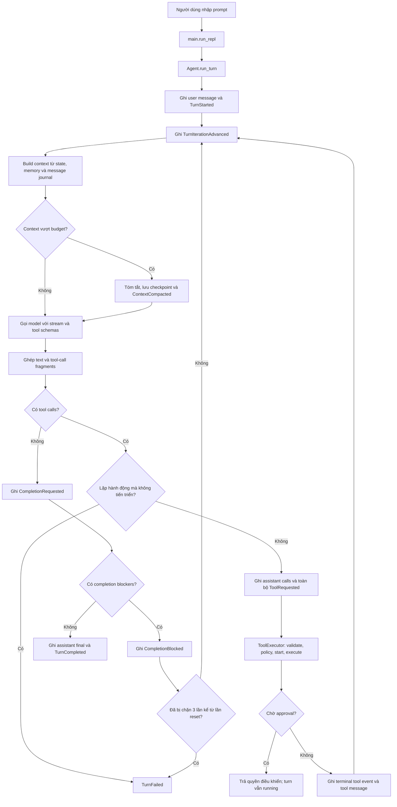
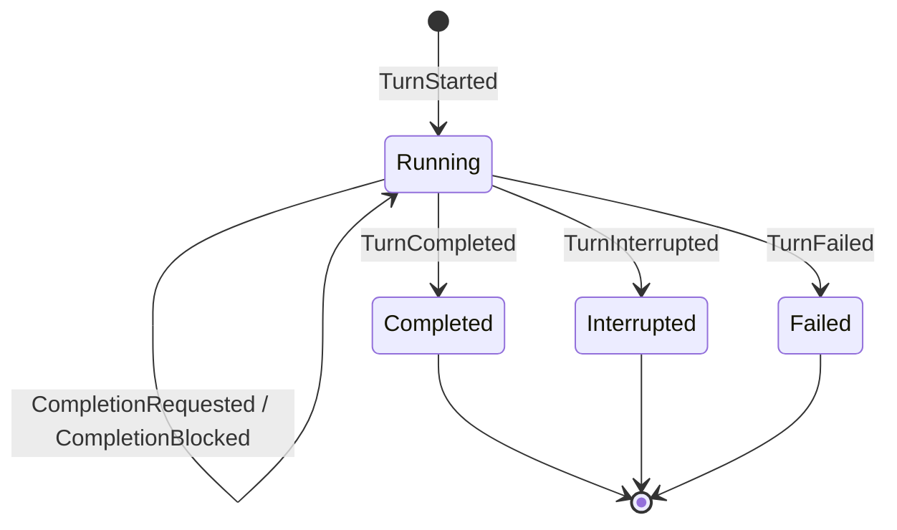
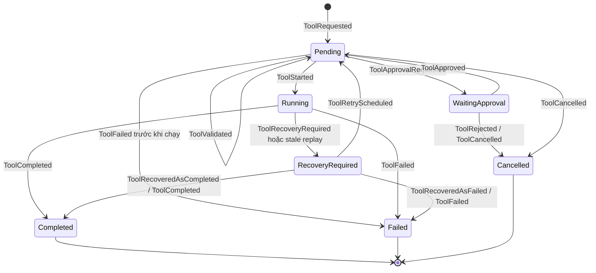
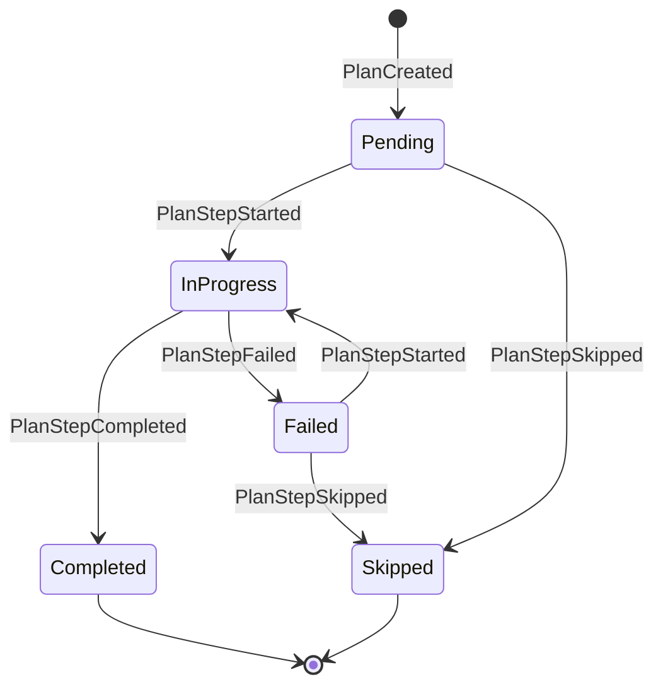

# State machine của Coding Agent: từ prompt đến kết quả cuối

Tài liệu này giải thích **code hiện tại** theo một lượt chạy cụ thể, dành cho
người đang mở source và `.llm-traces/` trong IDE. Nội dung được đối chiếu với
source, các test lifecycle và 3 file trace có trong repo tại ngày 03/10/2026.

Nếu chỉ nhớ một ý: **model đề xuất hành động; runtime thực thi, ghi event và
quyết định có được kết thúc hay không.** Model không trực tiếp ghi file hoặc
chuyển `TurnState.status` thành `completed`.

## 1. Nên đọc docs nào, theo thứ tự nào?

Với mục tiêu “mình nhập prompt, code chạy thế nào đến lúc trả kết quả”, đọc theo
thứ tự này:

| Thứ tự | Tài liệu | Đọc để hiểu gì? |
|---:|---|---|
| 1 | [Tài liệu này](state_machine.md) | Toàn bộ flow, state transition và cách đối chiếu trace. |
| 2 | [Lifecycle và luồng dữ liệu](agent_lifecycle_flows.md) | Bản đồ thành phần và sơ đồ tool, memory, agent loop. |
| 3 | [Turn termination và loop guards](agent_turn_termination_and_loop_guards_vi.md) | Khi nào hoàn tất, bị chặn, bị ngắt hoặc hết iteration. |
| 4 | [Source code flow guide](source_code_flow_guide_vi.md) | Đi sâu từ CLI xuống sandbox helper và đường quay về. |
| 5 | [Memory](memory.md) | Journal, checkpoint, context và project memory khác nhau thế nào. |
| 6 | [Python code reading order](python_code_reading_order_vi.md) | Đọc từng module và từng dòng Python khi đã có bản đồ flow. |
| 7 | [Runtime state management design](agent_runtime_state_management_design.md) | Lý do thiết kế, kiến trúc mục tiêu và lịch sử migration. |

File design đang mở trong IDE có cả phần đánh giá kiến trúc cũ, đề xuất và
migration plan. Không nên mặc định mọi đoạn trong đó mô tả implementation đang
chạy. Khi có khác biệt, đối chiếu **source và tests hiện tại**.

Đọc [run guide](run_guide.md) khi cần tìm journal trên disk; đọc
[sandbox operations](sandbox_v1_operations.md) khi cần hiểu container hoặc lỗi
Docker. Chưa cần đọc hết tài liệu security để hiểu agent loop.

## 2. Các khái niệm phải phân biệt trước

| Khái niệm | Nghĩa trong code | Ví dụ |
|---|---|---|
| Session/chat | Một cuộc hội thoại có journal riêng, gồm nhiều turn. | Thư mục trace `4f398bf2-.../`. |
| Turn | Một lần xử lý prompt người dùng, có thể gọi model nhiều lần. | File trace `5652067e-...txt`. |
| Iteration | Một vòng trong `_drive_turn()`: build context, gọi model, xử lý response. | `turn.iteration = 3`. |
| Model call | Một lần gọi `llm.complete()`. Có thể là call chính hoặc call tóm tắt context. | `lần gọi thứ: 3`. |
| Tool call | Yêu cầu model trả về, gồm tên tool, arguments và `tool_call_id`. | `write(path="index.html", ...)`. |
| Tool execution | Lần thực thi được runtime quản lý, có `execution_id` và lifecycle riêng. | UUID được hiển thị thành `exec_2`. |
| Event | Một sự kiện đã ghi vào journal. | `ToolStarted`, `TurnCompleted`. |
| State | Trạng thái dựng lại từ các event theo thứ tự. | `RuntimeState.executions[id].status`. |

Một turn có thể đi như sau:

```text
prompt
  → iteration 1: model yêu cầu write → runtime chạy write
  → iteration 2: model yêu cầu read  → runtime chạy read
  → iteration 3: model trả text     → runtime kiểm tra completion → kết thúc
```

Một response có thể chứa nhiều tool call. Runtime hiện thực thi chúng **tuần
tự**, theo thứ tự nhận được, sau khi đã ghi toàn bộ yêu cầu của batch.

`exec_1`, `exec_2`, ... là alias theo thứ tự execution trong **session**, không
reset về 1 ở mỗi turn. `tool_call_id`, `execution_id`, `turn_id` và `session_id`
là các ID khác nhau.

## 3. “State machine” thật sự nằm ở đâu?

Không có một enum chứa tất cả trạng thái kiểu
`THINKING → WRITING → VERIFYING → DONE`. Có nhiều lifecycle phối hợp:

| Lớp | State được quản lý | Nơi đọc chính |
|---|---|---|
| Turn | `running`, `completed`, `interrupted`, `failed` | [models](../src/runtime/models.py), [reducer](../src/runtime/reducer.py), [agent loop](../src/agent/loop.py). |
| Plan step | `pending`, `in_progress`, `completed`, `failed`, `skipped` | [reducer](../src/runtime/reducer.py), `Agent._apply_plan_action()`. |
| Tool execution | `pending`, approval, running, recovery, terminal | [executor](../src/runtime/executor.py), [reducer](../src/runtime/reducer.py). |
| Sandbox | `created`, `running`, `stopped`, `sealed`, `destroyed`, `error` | [sandbox session](../src/sandbox/session.py). |
| Context | Messages + checkpoint dùng cho lần gọi model kế tiếp | [compactor](../src/context/compactor.py), [checkpoint](../src/context/checkpoint.py). |

`src/runtime/machine.py` có class generic `StateMachine`, nhưng production
reducer và executor hiện **không dùng class này để điều khiển lifecycle**.
Đọc file đó để hiểu khái niệm transition; đọc `reducer.py` để biết rule thực tế.

### 3.1. Event-driven state hoạt động thế nào?

```text
Agent hoặc ToolExecutor quyết định cần ghi event
                    ↓
EventStore.append_event(): append JSONL → flush → fsync
                    ↓
replay(events): lần lượt gọi reduce_event(state, event)
                    ↓
RuntimeState mới
                    ↓
Agent dùng state này cho hành động hoặc prompt tiếp theo
```

Ví dụ `ToolStarted` làm execution đổi từ `pending` sang `running`;
`ToolCompleted` đổi sang `completed`; `TurnCompleted` đặt turn thành
`completed` và xóa `active_turn_id`.

Reducer kiểm tra transition hợp lệ. Ví dụ execution đã `completed` không được
nhận thêm `ToolStarted`. Historical transition sai khiến replay báo
`JournalCorruptionError`, thay vì dựng một state phỏng đoán.

Journal là nguồn sự thật của lifecycle. Text assistant, project memory và
checkpoint không có quyền tự thay đổi lifecycle.

## 4. Sơ đồ tổng thể từ prompt đến final

Các ô “Build context”, “Gọi model” trong sơ đồ là pha xử lý của loop, không phải
giá trị của `TurnStatus`.



Ngoài các nhánh trên, model/context exception làm turn `failed`; Ctrl+C trong
model call làm turn `interrupted`; dùng hết số vòng được phép làm turn `failed`.
Chi tiết các nhánh ở mục 10 và 11.

## 5. Trước khi nhận prompt: khởi tạo session

Đọc [main.py](../src/main.py) theo đường:

```text
main()
  → build_parser()
  → select_chat_path()
  → run_repl()
  → _default_agent_factory()
  → Agent.__init__()
```

### 5.1. CLI và sandbox

1. CLI chọn journal mới hoặc session cũ để resume.
2. Factory tạo `ControlPaths` theo state root, session và workspace identity.
3. Factory tạo `DockerBackend` và `SandboxSession`.
4. Session mới: `create()` kiểm tra môi trường, chuẩn bị workspace và tạo
   container; `start()` chạy container rồi verify runtime.
5. Session cũ ở `stopped`: `resume()` đối chiếu identity, mounts, limits và
   security settings rồi start lại.
6. Factory bind các filesystem/bash tool với session này, rồi khởi tạo Agent.

CLI hiện tạo session mới ở `WorkspaceMode.LIVE`: file được write/edit thành
công sẽ xuất hiện trực tiếp trong workspace. Code còn hỗ trợ `SHADOW` cho
session được tạo theo mode đó hoặc metadata cũ; khi ấy changeset cần apply.

Model được gọi từ control plane. Lệnh bash và filesystem operations đi qua
Docker sandbox child; sandbox offline không có nghĩa control plane không thể
gọi model provider.

### 5.2. Agent khôi phục những gì?

`Agent.__init__()` mở/lock journal, tạo memory manager và checkpoint store,
load checkpoint nếu hợp lệ, rồi `replay()` journal thành `RuntimeState`.
Checkpoint hỏng bị bỏ qua với warning; lifecycle vẫn được dựng từ journal.

Mỗi lần mở writer có `runtime_instance_id` mới. ID này giúp nhận ra tool đang
`running` thuộc process cũ, tức outcome có thể chưa được xác nhận.

REPL xử lý pending approval/recovery **khi vào `run_repl()`**, trước vòng nhập
prompt. Nó không tự gọi model để tiếp tục active turn; người dùng nhập `resume`.

## 6. Khi nhập prompt: `Agent.run_turn()`

Prompt bình thường đi từ `run_repl()` vào `run_turn()`. Các control command như
`/memory`, `/remember`, `/forget`, `/changes`, `/apply`, `/discard` được CLI xử
lý riêng, không mặc định tạo turn gửi model.

`run_turn()` làm theo thứ tự:

1. Từ chối nếu session còn `active_turn_id`.
2. Tạo `turn_id` mới.
3. Ghi `UserMessageRecorded`. Nếu có `/img`, content có text và image parts.
4. Ghi `TurnStarted` với `goal`, `plan_mode`, `resumes_turn_id`.
5. Reducer tạo `TurnState(status=RUNNING)` và gán `active_turn_id`.
6. `_run_with_trace()` mở trace của turn rồi gọi `_drive_turn()`.

`plan_mode` mặc định là `optional`; REPL hiện gọi `run_turn()` với default này.
API Python cho phép caller truyền `PlanMode.REQUIRED`.

### 6.1. State machine của turn



| Trạng thái | Ý nghĩa | Có còn active turn không? |
|---|---|---|
| Chưa có turn | Session sẵn sàng nhận prompt. | Không. |
| `running` | Đang xử lý hoặc đang đợi approval/recovery. | Có. |
| `completed` | Runtime đã chấp nhận final answer. | Không. |
| `interrupted` | Turn đã bị ngắt. | Không. |
| `failed` | Turn đã kết thúc vì lỗi/guard. | Không. |

`TurnStatus.IDLE` có trong enum, nhưng `run_turn()` không tạo object turn ở
`idle`. Trước turn thường là `active_turn_id = None`.

`interrupted` và `failed` là terminal state. `resume_active_turn()` chỉ tiếp tục
turn còn active; nó không chuyển terminal turn trở lại `running`.
`resumes_turn_id` chỉ ghi quan hệ trên turn mới nếu caller truyền vào.

## 7. Trong mỗi iteration: build context rồi gọi model

Đọc `_drive_turn()` cùng `_build_context()` và `_consume_stream()` trong
[agent loop](../src/agent/loop.py).

### 7.1. Model nhìn thấy dữ liệu gì?

```text
request
  model
  messages
    system: instruction + PROJECT.md + runtime state frame + workspace
    checkpoint message, nếu có
    lịch sử message sau cutoff của checkpoint, đã qua projection
  tools
    read, write, edit, bash
    update_plan với schema phụ thuộc state hiện tại
  stream: true
  stream_options: include_usage
```

System message được dựng mới mỗi iteration, nên state frame phản ánh plan và
turn mới nhất. `PROJECT.md` chỉ là advisory project facts.

`EventStore.message_records()` lấy **message events** từ journal. Những event
như `ToolStarted`, `PlanStepCompleted` không được gửi nguyên envelope cho
model; runtime gửi thông tin phù hợp qua state frame và tool results.

Context không phải bản sao nguyên vẹn journal:

- Call write/edit đã hoàn thành có arguments dài từ 1.000 byte được thay bằng
  `[omitted: ... bytes, sha256=...]` trong projection gửi model.
- Lịch sử `update_plan` của turn hiện tại được lược bỏ, giữ lỗi control call
  gần nhất nếu control execution cuối cùng bị fail. State plan hiện tại nằm
  trong system frame.
- Nếu có checkpoint, chỉ lấy message sau `covers_through_seq`.

Các thao tác này không sửa nội dung journal gốc.

### 7.2. Context compaction

`Compactor.build_context()` kiểm tra token budget. Default hiện tại:

```text
context_window          = 256.000
reserved_output_tokens  =  16.000
reserved_tool_tokens    =  16.000
safety_margin_tokens    =   8.000
available_input_tokens  = 216.000
```

Budget là chính sách/ước lượng nội bộ, không phải xác nhận chính xác context
limit từ provider cho mọi model.

Nếu vượt budget, compactor nhóm assistant tool calls cùng tool results, chọn
phần cũ để tóm tắt, giữ phần gần nhất, tạo checkpoint JSON có cấu trúc. Agent
lưu checkpoint trước rồi ghi `ContextCompacted`.

Compaction có thể gọi `llm.complete_text()`, nên **số “lần gọi thứ” trong trace
có thể nhiều hơn số iteration**. Call tóm tắt thường `stream=false`, không có
tool schemas và prompt yêu cầu structured handoff checkpoint.

Checkpoint không quyết định turn/plan/tool đã hoàn thành hay chưa. Lỗi build
context/summary/save xảy ra trong `try` của model iteration hiện được ghi
`TurnFailed` với category `model`; category này không luôn có nghĩa provider
là nguyên nhân.

### 7.3. Stream chưa phải tool execution

`llm.complete()` dùng **OpenAI Python SDK, Chat Completions API**.
`_consume_stream()` ghép text delta và tool fragments theo `index`.

```text
fragments của name/arguments
        → StreamedToolCall hoàn chỉnh
        → stream kết thúc
        → request_batch()
        → execute()
```

Log `[model] receiving tool call write: ... KiB` là model đang sinh arguments;
chưa chứng minh write đã chạy. `tool> write` xuất hiện khi loop bắt đầu xử lý
execution; journal `ToolStarted` mới đánh dấu ranh giới trước side effect.

## 8. Nếu model trả tool calls

### 8.1. Thứ tự journal trong một batch

```text
AssistantToolCallsRecorded
ToolRequested cho call A
ToolRequested cho call B
... toàn bộ batch được ghi ...
ToolValidated A
ToolStarted A
side effect A
ToolCompleted hoặc ToolFailed A
ToolMessageRecorded A
ToolValidated B
...
```

`request_batch()` tạo execution UUID riêng cho từng call, parse JSON arguments
và ghi replay policy. Sau đó loop gọi `execute()` từng execution.

Ghi `ToolStarted` có `flush` và `fsync` **trước** `tool.run()` hoặc
`execute_runtime()`. Nhờ vậy sau crash runtime biết execution nào có thể đã
bắt đầu gây side effect.

### 8.2. State machine của tool execution



`validated` không phải một status riêng: `ToolValidated` giữ execution ở
`pending`, cập nhật arguments. Enum có 7 status như trong sơ đồ.

| Bước | Khi gặp vấn đề | Runtime ghi gì? |
|---|---|---|
| Lookup tool | Không có tool theo tên. | `ToolFailed(category=unknown_tool)`. |
| Parse | Arguments không phải JSON hợp lệ. | `ToolFailed(category=invalid_json)`. |
| Validate | Thiếu required fields theo tool validation. | `ToolFailed(category=validation)`. |
| Policy | `deny`. | `ToolCancelled`. |
| Policy | `ask`. | `ToolApprovalRequested`, đợi handler hoặc user. |
| Recovery metadata | Không lấy được metadata trước effect. | `ToolFailed(category=recovery_metadata)`. |
| Run | Tool ném exception thường. | `ToolFailed(category=exception)`. |
| Result | `ToolResult.success=False`. | `ToolFailed(category=tool_result)`. |
| Result | `ToolResult.success=True`. | `ToolCompleted`. |

Default policy hiện là `allow` nếu caller không inject policy. Cơ chế approval
có trong runtime, nhưng không có nghĩa mọi write/bash mặc định đều hỏi user.
`BaseTool.validate()` chủ yếu kiểm tra required fields; validation sâu hơn nằm
trong từng tool, plan action hoặc sandbox helper, không phải full JSON Schema
validation chung tại executor.

Tool fail thường **không làm turn fail ngay**: lỗi trở thành tool message, model
nhìn thấy ở iteration kế tiếp và có thể sửa arguments hoặc chọn cách khác.

### 8.3. Tool thật sự chạy ở đâu?

```text
write/read/edit
  → ToolExecutor.execute()
  → tool.run() → execute()
  → SandboxSession.fs_call()
  → DockerBackend helper transport
  → sandbox-image/sandbox_fs.py trong container
  → /workspace

bash
  → BashTool.execute()
  → ExecRequest
  → SandboxSession.exec()
  → DockerBackend
  → sandbox-image/sandbox_exec.py
  → shell command trong container

update_plan
  → UpdatePlanTool.execute_runtime()
  → Agent._apply_plan_action()
  → plan events trong journal
```

OS tool không bind sandbox trả lỗi, không fallback sang host filesystem/shell.
Trong LIVE mode, `/workspace` là workspace được mount trực tiếp, nên file có
thể đổi ngay trước khi turn có final answer.

### 8.4. Kết quả quay lại model

`ToolResult` có `raw`, `compact`, `success`, `exit_code`, `metadata`.
Terminal tool event lưu result; `ToolMessageRecorded` chứa phần `compact` kèm
execution alias nếu thành công.

Với bash được gắn `verification_kind`, tool message có `Verification` JSON
gồm loại verification, `passed` và execution alias. Structural check chỉ chứng
minh cấu trúc/static properties; đọc HTML không chứng minh giao diện render
đúng hoặc JavaScript hoạt động trong browser.

Sau batch, loop quay lại build context và gọi model. Đây là bước model đọc
kết quả thực thi, khác với lúc nó mới đề xuất tool call.

## 9. Nếu task có plan

Plan là phần công việc được runtime quản lý; model dùng `update_plan` để gửi
intent. Nó không trực tiếp sửa dataclass `PlanStep`.

### 9.1. Plan optional và required

- `optional` và chưa tạo plan: có thể final trực tiếp.
- `required` và chưa tạo plan: completion bị chặn bởi `missing_required_plan`.
- Đã có plan: các step `required=true` chưa hoàn tất sẽ chặn final, kể cả
  turn ban đầu ở mode `optional`.
- Step `required=false` không bắt buộc hoàn thành để pass completion guard.

`allowed_actions` trong state frame và `update_plan` schema hiện tập trung vào
**plan intents**, không phải danh sách whitelist cho mọi filesystem/bash call.

### 9.2. Lifecycle của plan step



Model hiện được expose `create_plan`, `complete_step`, `fail_step`,
`revise_plan`. Không có public intent `start_step` hoặc `skip_step` cho model.

Khi gọi `complete_step` hoặc `fail_step` trên step `pending`/`failed`, runtime
ghi nội bộ `PlanStepStarted`, rồi ghi complete/fail event. Vì vậy giữa hai
model request bạn có thể chỉ thấy `pending → completed`, dù journal có cả
`in_progress` ở giữa. Chỉ một step được `in_progress` tại một thời điểm.

Caller có API `skip_plan_step()` với reason; REPL hiện không có command riêng
để skip step. Model không được hạ `required=true` thành false khi revise.

### 9.3. Khi nào complete step hợp lệ?

| Completion policy | Dữ liệu cần gửi | Runtime kiểm tra |
|---|---|---|
| `self_attested` | `note` không rỗng. | Có lời xác nhận việc hoàn tất. |
| `evidence_required` | `evidence_execution_ids`. | Reference resolve được tới execution `completed` cùng session. |

Model có thể dùng alias `exec_2`; runtime resolve alias thành execution UUID
để lưu evidence. Schema gợi ý các successful execution ngoài `update_plan`.

Giới hạn hiện tại: evidence check xác nhận execution thành công trong cùng
session; nó không tự chứng minh execution đó liên quan đúng task, thuộc đúng
turn, hay thực sự kiểm thử hành vi. Cần đọc command/result để đánh giá chất
lượng evidence.

Plan action trả JSON envelope với `outcome` (`applied`, `noop`, `rejected`),
`state_version_before/after`, `delta`, `current_state`, và `error` nếu có.
Intent bị reject không được coi là plan đã hoàn tất.

## 10. Nếu model trả text: khi nào là kết quả cuối?

**Response không có tool call là candidate final**, chưa tự động là completed.
Loop thực hiện:

```text
response_text
  → CompletionRequested(candidate_text)
  → completion_blockers(runtime_state, turn_id)
      có blockers: CompletionBlocked → iteration tiếp theo hoặc TurnFailed
      không có: AssistantMessageRecorded(final=true) → TurnCompleted
```

### 10.1. Ba loại blocker hiện có

| Code | Khi nào xuất hiện? |
|---|---|
| `missing_required_plan` | Turn ở mode required nhưng chưa có plan. |
| `unfinished_required_steps` | Plan có required step chưa `completed` hoặc `skipped`. |
| `unresolved_tool_executions` | Tool của turn đang `waiting_approval`, `running` hoặc `recovery_required`. |

Chi tiết implementation cần nhớ:

- `pending` **không nằm trong** danh sách status tool mà completion guard
  kiểm tra. Normal flow xử lý batch trước khi hỏi model lần tiếp theo; resume
  cũng drain pending trước. Đừng mô tả guard là kiểm tra mọi nonterminal tool.
- Frame `blockers` trong system prompt chỉ liệt kê required step IDs; nó
  không phải toàn bộ kết quả `completion_blockers()`.
- Tool `failed`/`cancelled` đã terminal nên không tự chặn completion. Nếu
  không có required plan work còn dở, turn vẫn có thể completed với câu trả
  lời giải thích lỗi hoặc giới hạn.
- `completed` nghĩa lifecycle đã đóng hợp lệ, không phải bằng chứng mọi
  yêu cầu người dùng đã được kiểm chứng đúng về mặt nghiệp vụ.

### 10.2. Text trên terminal và durable final

Khi chưa enforce plan, text stream có thể được in ngay khi nhận delta. Vì thế
thấy chữ trên terminal không đồng nghĩa journal đã có final.

Khi `plan_mode=required` hoặc turn đã có plan, loop không in candidate text
trong stream; nó in final sau khi guard pass và ghi completion.

Dấu xác nhận chắc nhất trong journal là:

```text
AssistantMessageRecorded với payload.final = true
TurnCompleted cùng turn_id, payload.final_text chứa kết quả
```

## 11. Các nhánh dừng, pause và chống loop

| Tình huống | State/event | Điều cần hiểu |
|---|---|---|
| Đợi approval, không có handler | Tool `waiting_approval`; loop trả `""`. | Turn vẫn `running`, không phải completed. |
| Ctrl+C khi gọi/đọc stream model | `TurnInterrupted`. | Partial text không được persist như final. |
| Ctrl+C khi đang thực thi tool | Có thể ghi `ToolRecoveryRequired`; hủy các call còn lại; `TurnInterrupted`. | Side effect có thể đã xảy ra, cần kiểm tra outcome. |
| Model/context exception | `TurnFailed(category=model)` rồi raise. | REPL in `Runtime failed: ...`. |
| Candidate final bị chặn 3 lần kể từ reset | `TurnFailed(category=repeated_incomplete_plan)`. | Chặn việc liên tục tuyên bố xong khi plan chưa xong. |
| Batch lặp y hệt, không có progress | `TurnFailed(category=stagnation_detected)`. | So sánh action signature và progress fingerprint. |
| Hết vòng xử lý | `TurnFailed(category=max_iterations)`. | Mặc định tối đa 20 vòng cho một lần `_drive_turn()`. |

`completion_block_count` tăng khi `CompletionBlocked`, được reset bởi plan
events và một số terminal tool events. Không phải đếm tổng số lần blocked
suốt session.

Progress fingerprint gồm `state_version`, hash tổng hợp kết quả write/edit
đã hoàn thành, completion blockers và successful execution gần nhất.
`state_version` nhận `seq` của một số event có ý nghĩa tiến triển; nó **không
bằng journal.last_seq** và không tăng ở mọi event. Trong trace nó có thể giữ
nguyên dù iteration đã tăng.

Hash dùng cho progress không phải scan toàn bộ workspace. Stagnation guard
cũng không phát hiện mọi vòng lặp: chỉ so batch liên tiếp trong cùng lần
`_drive_turn()`, và successful execution mới có thể làm fingerprint đổi.

Resume có budget vòng mới, trong khi số iteration persisted tiếp tục tăng.
Vì thế 20 là giới hạn mỗi lần drive, không phải trần tuyệt đối của một turn
qua nhiều lần resume. Guard này cũng không phải timeout theo thời gian.

Không suy luận state chỉ từ string `run_turn()` trả về: pause/failure có thể
trả string rỗng; nhánh hết iteration có thể trả candidate text đã có trước
đó. Cần kiểm tra turn status và terminal event.

## 12. Restart, recovery và resume

### 12.1. Crash sau `ToolStarted`

```text
ToolStarted đã được ghi
  → process chết trước terminal event
  → process mới replay journal
  → running thuộc runtime instance cũ được project thành recovery_required
  → pending_runtime_actions() yêu cầu giải quyết outcome
```

Stale recovery có thể là **state suy ra trong replay**, không nhất thiết đã
có dòng `ToolRecoveryRequired` trong journal.

Không thể thấy `ToolStarted` rồi mặc định tool chưa làm gì. Nó có thể đã ghi
file hoặc chạy command nhưng chưa kịp ghi kết quả.

### 12.2. Replay policy

| Tool | Policy hiện tại | Cách xử lý khi outcome chưa rõ |
|---|---|---|
| `read` | `replay_safe` | Recovery API cho phép retry. |
| `write` | `reconcilable` | Retry cần current hash khớp before hash; completed cần khớp expected after hash. |
| `edit` | `reconcilable` | Có before hash, nhưng metadata hiện chưa có expected after hash như write. |
| `bash` | `manual` | Không cho retry qua recovery API. User xác nhận completed/failed với note. |
| `update_plan` | `replay_safe` | Có thể retry qua recovery API, vẫn chịu guard của plan intent. |

Policy không có nghĩa runtime tự chạy lại mọi tool tương ứng khi khởi động.
CLI hiện yêu cầu recovery decision. Với `edit`, đường xác nhận completed
bằng expected-after hash có hạn chế do metadata thiếu giá trị đó; cần kiểm
tra file và outcome thực tế, không giả định reconcile luôn có đủ evidence.

### 12.3. Tiếp tục active turn

`resume_active_turn()`:

1. Yêu cầu turn còn active.
2. Từ chối nếu còn pending approval/recovery action.
3. Thực thi các execution `pending` của turn trước khi hỏi model.
4. Nếu journal đã có assistant `final=true` nhưng chưa có `TurnCompleted`,
   ghi completion từ final đã lưu; không gọi model lại.
5. Nếu chưa có final đã lưu, tiếp tục `_drive_turn()`.

User prompt cũ không được append lần nữa.

Trong REPL hiện tại, menu xử lý pending runtime actions chạy lúc startup.
Nếu một turn pause chờ approval giữa phiên mà không có handler, vòng nhập
prompt không tự mở lại menu đó. Đây là giới hạn wiring CLI cần biết khi đọc
flow approval; API của Agent vẫn có `resolve_approval()`.

### 12.4. Kết thúc turn khác kết thúc session

`TurnCompleted` đưa REPL về nhận prompt tiếp theo; sandbox thường vẫn chạy.
`exit`/EOF gọi `Agent.close()`, stop sandbox và đóng/unlock journal.
Stop container không đồng nghĩa remove container.

`/discard` destroy sandbox. Với LIVE mode, những file đã sửa vẫn còn trong
workspace; lifecycle thất bại hay discard không tự rollback các sửa đổi đó.

## 13. Trace và journal lưu gì, nằm ở đâu?

### 13.1. Trace là góc nhìn của model request

Mỗi block trace hiện chứa:

```text
lần gọi thứ: N
token input: ... (provider hoặc ước tính)
token output: ... (provider hoặc ước tính)
context:
{
  "model": "...",
  "messages": [...],
  "stream": true,
  "tools": [...]
}
```

`_append_trace()` ghi request và token counts; nó **không ghi trực tiếp
response body**. Text/tool fragments được thu để ước tính output tokens khi
provider không trả usage, nhưng không được xuất thành một mục response.

Hệ quả:

- Muốn biết output của call N, thường nhìn assistant/tool messages được đưa
  vào request N+1.
- Assistant tool call xuất hiện trong request N+1 là **lịch sử của call trước**,
  không phải yêu cầu thực thi lại ở call N+1.
- Response cuối không có request kế tiếp trong turn để chứa nó; đọc journal
  để lấy final text và status.
- Token output lớn chỉ cho biết lượng output theo usage/ước lượng; không tự
  chứng minh đó là HTML, final answer hay tool đã chạy thành công.

Trace ghi block sau response thường hoặc trong `finally` của stream wrapper.
Process chết đột ngột có thể chưa kịp ghi block đang chạy.

### 13.2. Đường dẫn dữ liệu

```text
<state-root>/
  chats/<session-id>.jsonl                 journal
  checkpoints/<session-id>.json            checkpoint
  projects/<workspace-identity>/PROJECT.md project memory
  traces/<session-id>/<turn-id>.txt         trace đang chạy hoặc đang pause
  sandboxes/<session-id>/metadata.json      sandbox metadata

<workspace>/
  .llm-traces/<session-id>/<turn-id>.txt     trace được xuất khi turn terminal
```

`_run_with_trace()` xuất trace sang workspace khi `active_turn_id` không còn
là turn đó, gồm completed/interrupted/failed; **có file trace ở workspace
không đồng nghĩa turn completed**. Khi pause chờ approval, trace thường còn
trong state root. Resume mở lại cùng file và tiếp tục đếm call.

State root khi chạy trực tiếp mặc định là
`$XDG_STATE_HOME/sang-coding-agent`, hoặc
`~/.local/state/sang-coding-agent` nếu không có `XDG_STATE_HOME`; `--state-root`
có thể đổi vị trí này.

Compose hiện đặt state root là `/state` trong named volume
`coding-agent-state`. Vì vậy không tìm thấy journal trong repo hay đường
default trên host chưa có nghĩa journal không tồn tại. Trong lần đối chiếu
này, journal của hai session trace không có ở đường default
`~/.local/state/sang-coding-agent/chats/`; chưa đọc được journal tương ứng để
xác nhận final outcome của các trace mẫu.

### 13.3. Cách đọc journal

Mỗi dòng là một event JSON. Đọc theo `seq`, rồi lọc `turn_id` cần xem.

| Field | Dùng để làm gì? |
|---|---|
| `seq` | Thứ tự event trong journal. |
| `event_type` | Sự kiện gì vừa được ghi. |
| `aggregate_type`, `aggregate_id` | Event thuộc turn, plan, tool execution hay message nào. |
| `turn_id` | Gom events của lượt xử lý prompt. |
| `runtime_instance_id` | Phân biệt các lần mở process. |
| `causation_id`, `correlation_id` | Liên hệ nguyên nhân/chuỗi xử lý khi emitter có ghi. |
| `payload` | Arguments, result, error, final text hoặc dữ liệu transition. |

Để xem timeline gọn từ một journal đã tìm được, có thể dùng standard library
Python, thay path và turn ID theo session của bạn:

```python
import json
from pathlib import Path

journal = Path("/state/chats/4f398bf2-1ae6-46e3-a120-d6e97edd5ebb.jsonl")
turn_id = "5652067e-996b-46f1-b186-06df2527622f"
for line in journal.read_text(encoding="utf-8").splitlines():
    if not line.strip():
        continue
    event = json.loads(line)
    if event.get("turn_id") != turn_id:
        continue
    print(event["seq"], event["event_type"], event["aggregate_id"])
    if event["event_type"] == "TurnCompleted":
        print("FINAL:", event["payload"].get("final_text"))
    elif event["event_type"] == "TurnFailed":
        print("ERROR:", event["payload"].get("error"))
```

`/state/...` là đường trong control-plane container nếu chạy Compose; dùng
đường thực tế của host nếu chạy trực tiếp. Script chỉ đọc file, không cần
khởi tạo `Agent` hay start sandbox để xem journal.

## 14. Đọc chính file trace bạn đang mở

File:
[5652067e-996b-46f1-b186-06df2527622f.txt](../.llm-traces/4f398bf2-1ae6-46e3-a120-d6e97edd5ebb/5652067e-996b-46f1-b186-06df2527622f.txt).

```text
session_id = 4f398bf2-1ae6-46e3-a120-d6e97edd5ebb
turn_id    = 5652067e-996b-46f1-b186-06df2527622f
goal       = tạo web bán bún bò bằng file html
```

### 14.1. Bốn request đã lưu

| Call | Dòng bắt đầu | Iteration | state_version | Input/output tokens theo provider | Có gì trong request? |
|---:|---:|---:|---:|---|---|
| 1 | 1 | 1 | 2 | 372 / 114 | System và user, chưa có tool history. |
| 2 | 180 | 2 | 8 | 436 / 3.204 | Call write ngắn trước đó và kết quả `exec_1`. |
| 3 | 377 | 3 | 15 | 529 / 34 | Thêm write file đầy đủ và kết quả `exec_2`. |
| 4 | 592 | 4 | 22 | 3.703 / 105 | Thêm read file và kết quả `exec_3`. |

Ở cả bốn request, `turn.status` là `running`, `plan=null`, `blockers=[]`.
`allowed_actions=[create_plan]` có nghĩa model **có thể** tạo plan, không phải
plan đã tồn tại hay bắt buộc phải tạo.

Trace này không có request tóm tắt context: cả bốn là stream call chính.

### 14.2. Những gì nhìn thấy từ lịch sử ở request tiếp theo

1. **Output call 1 được nhìn thấy trong request 2:** model đã yêu cầu write
   `index.html` với content ngắn 62 ký tự, dừng ở `<meta charset="UTF-8`.
   Tool trả `Successfully wrote index.html`, `Execution ID: exec_1`.
   Write thành công chỉ chứng minh đã ghi content được yêu cầu; lúc này file
   chưa phải HTML đầy đủ.
2. **Output call 2 được nhìn thấy trong request 3:** model yêu cầu write lại
   `index.html`. Content dài được project thành
   `[omitted: 9920 bytes, sha256=2f6605a0...]`.
   Tool trả write thành công, `exec_2`.
3. **Output call 3 được nhìn thấy trong request 4:** model yêu cầu
   `read(path="index.html")`. Tool result chứa các dòng HTML đã đánh số,
   có title `Bún Bò Huế Mệ Dung`, rồi alias `exec_3`.
4. **Output call 4 không được ghi trực tiếp trong trace:** có usage output
   105 tokens, nhưng không có response body hoặc request 5. Muốn biết exact
   final text và completed/failed/interrupted, đọc journal của turn.

Tuyến quan sát được:

```text
prompt
  → model call 1 → write HTML ngắn → exec_1 thành công
  → model call 2 → write HTML đầy đủ → exec_2 thành công
  → model call 3 → read HTML → exec_3 thành công
  → model call 4 → response không được lưu trực tiếp trong trace
```

Nếu call 4 trả text không có tool, normal source path tiếp theo sẽ là
`CompletionRequested → guard → assistant final → TurnCompleted`. Đây là mô
tả đường code, **không phải xác nhận journal mẫu đã chứa các event đó**.

Không thấy browser execution hoặc behavioral check trong tool history của
trace này. Read HTML là bước đọc lại nội dung, không đủ kết luận trang web đã
được kiểm thử trên desktop/mobile.

### 14.3. Cách đọc nhanh trong IDE

1. Search `lần gọi thứ:` để nhảy giữa bốn request.
2. Trong system content, xem `Current runtime state`; trace cũ có thể dùng
   nhãn tiếng Việt `Trạng thái runtime hiện tại`.
3. Ghi lại `turn.id`, `iteration`, `state_version`, `plan`, `allowed_actions`.
4. Xem cuối `messages` để tìm assistant call và tool result mới nhất so với
   request trước. Ghép bằng `tool_call_id`.
5. So cùng call ID giữa các request: đó là history lặp lại, không đếm thành
   nhiều execution mới.
6. Đối chiếu journal để xác định event timeline và final outcome.

Lệnh tìm các dấu mốc từ thư mục repo:

```bash
rg --files --hidden .llm-traces
rg -n 'lần gọi thứ:|token input:|token output:|Execution ID:|Verification:' .llm-traces
```

Không cần đọc hết tool schemas lặp lại ở mỗi block; đọc lần đầu để hiểu các
tool model có, rồi tập trung state frame và phần messages mới.

## 15. Hai trace còn lại giúp hiểu multi-turn

Session `114bcf11-a218-419f-8968-38062f0b1585` có hai turn:

| Trace | Prompt | Request chính quan sát được |
|---|---|---|
| [8b90cd9d-e65c-4a6a-bc1b-0ab81f45bb15.txt](../.llm-traces/114bcf11-a218-419f-8968-38062f0b1585/8b90cd9d-e65c-4a6a-bc1b-0ab81f45bb15.txt) | “tạo web bán cơm tấm bằng 1 file html” | 4 calls; history cho thấy bash liệt kê workspace, write `com-tam.html`, read file. |
| [8c68c078-4a9b-40bf-94a5-cc1265f136c3.txt](../.llm-traces/114bcf11-a218-419f-8968-38062f0b1585/8c68c078-4a9b-40bf-94a5-cc1265f136c3.txt) | “mình muốn làm file đó đa dạng món hơn” | 5 calls; có history turn trước, sau đó thêm 3 edit và một read. |

Request đầu của turn thứ hai chứa final text của turn trước trong history.
Đó là ví dụ response cuối của một turn có thể xuất hiện **trong trace turn
sau cùng session**, dù trace của chính turn trước không ghi response body.

Ở turn thứ hai, `lần gọi thứ` bắt đầu lại từ 1 và iteration bắt đầu từ 1,
nhưng execution mới dùng alias `exec_4`, `exec_5`, `exec_6`, `exec_7` vì alias
tính theo session. Các call `exec_1..3` xuất hiện trong context là lịch sử.

## 16. Mở source theo một lần chạy cụ thể

Đây là tuyến đọc dành riêng cho hiểu flow; khác tuyến học Python từng module
từ đơn giản đến phức tạp trong tài liệu reading order.

| Bước | Mở file/hàm | Câu hỏi cần trả lời |
|---:|---|---|
| 1 | [main.run_repl](../src/main.py) | Prompt thường, control command và resume được phân nhánh ra sao? |
| 2 | [Agent.run_turn](../src/agent/loop.py) | User message và TurnStarted được ghi lúc nào? |
| 3 | [runtime.models](../src/runtime/models.py) | Turn/plan/tool có field và status nào? |
| 4 | [Agent._drive_turn](../src/agent/loop.py) | Một vòng đi qua nhánh tools hay completion như thế nào? |
| 5 | [Agent._build_context](../src/agent/loop.py), [Compactor.build_context](../src/context/compactor.py) | Model nhìn thấy gì, phần nào bị omit hoặc compact? |
| 6 | [llm.complete](../src/model/llm.py), `Agent._consume_stream()` | Request được gửi và response fragments được ghép ra sao? |
| 7 | [ToolExecutor.request_batch/execute](../src/runtime/executor.py) | Khi nào validate, policy, persist và side effect? |
| 8 | [EventStore.append_event](../src/memory/event_store.py), [reduce_event/replay](../src/runtime/reducer.py) | Event đổi state và đảm bảo durability như thế nào? |
| 9 | [filesystem tools](../src/tools/filesystem.py), [bash tool](../src/tools/terminal.py), [sandbox session](../src/sandbox/session.py) | Tool delegate đi đâu và result trở lại thế nào? |
| 10 | `Agent._apply_plan_action()`, [UpdatePlanTool.schema](../src/tools/plan.py) | Model gửi intent gì, runtime áp dụng guard nào? |
| 11 | [completion_blockers](../src/runtime/reducer.py), `Agent._resume_active_turn()` | Final được chấp nhận và crash được tiếp tục ra sao? |

Khi đi qua mỗi hàm, ghi một dòng:

```text
Input → event được append → state thay đổi → side effect → output → caller tiếp theo
```

Ví dụ write:

```text
model tool call
  → AssistantToolCallsRecorded
  → ToolRequested (pending)
  → ToolValidated (vẫn pending)
  → ToolStarted (running; metadata trước write đã được lưu)
  → sandbox ghi file
  → ToolCompleted (completed)
  → ToolMessageRecorded (compact + exec alias)
  → model iteration tiếp theo
```

## 17. Test nào dùng để kiểm chứng cách hiểu?

Không cần gọi model thật để học lifecycle. Đọc các test dùng fake response và
fake tool theo các nhóm sau:

| Nhóm | Test file | Hành vi cần tìm |
|---|---|---|
| Prompt → tool → final | [test_agent_loop.py](../tests/test_agent_loop.py) | Tool result gửi lại model, direct text completion, tool lỗi, stream interruption, stagnation. |
| Event → state | [test_reducer.py](../tests/test_reducer.py) | Replay deterministic, transition sai, stale running, state frame và blockers. |
| Durability tool | [test_tool_lifecycle.py](../tests/test_tool_lifecycle.py) | Batch requested trước effect, started trước execute, approval/deny và terminal guard. |
| Plan | [test_plan_lifecycle.py](../tests/test_plan_lifecycle.py) | Optional/required, evidence, internal start, rejected/noop intents, context synchronization. |
| Crash/resume | [test_recovery.py](../tests/test_recovery.py) | Không chạy lại completed, không duplicate user, drain pending, persisted final không gọi model lại. |
| Journal | [test_event_store.py](../tests/test_event_store.py) | Envelope, seq, lock, fsync, corruption và message projection. |
| Context | [test_compactor.py](../tests/test_compactor.py), [test_checkpoint.py](../tests/test_checkpoint.py) | Budget, interaction groups, checkpoint scope và atomic persistence. |

Khi đã biết source path, có thể chạy unit tests tương ứng trong môi trường
đã cài dependency của repo:

```bash
PYTHONPATH=src python -m unittest tests.test_agent_loop tests.test_reducer tests.test_tool_lifecycle tests.test_plan_lifecycle tests.test_recovery
```

## 18. Checklist tự giải thích một trace bất kỳ

- Xác định đúng session và turn từ path, rồi đối chiếu `turn.id` trong frame.
- Phân biệt request chính và request tóm tắt; không đồng nhất call number
  với iteration trong mọi trường hợp.
- Tìm phần history mới ở từng request; không đếm lại tool call ID cũ.
- Ghép assistant call và tool result bằng `tool_call_id`; dùng execution ID
  trong journal để theo lifecycle.
- Với plan, xem required steps và trạng thái, không chỉ đọc lời assistant
  nói “đã xong”.
- Với `[omitted: ...]`, hiểu đó là context projection; xem journal hoặc file
  thực tế để đọc nội dung đầy đủ.
- Với final, tìm `AssistantMessageRecorded(final=true)` và `TurnCompleted`;
  với lỗi, tìm `TurnFailed`/`TurnInterrupted` và recovery action còn lại.
- Với artifact, kiểm tra file và verification thực tế; lifecycle completed
  không thay thế kiểm chứng sản phẩm.
